# GitHub MentraOS Webhook Relay - Architekturdokumentation

**Über arc42**

arc42, das Template zur Dokumentation von Software- und
Systemarchitekturen.

Template Version 8.2 DE. (basiert auf AsciiDoc Version), Januar 2023

Created, maintained and © by Dr. Peter Hruschka, Dr. Gernot Starke and
contributors. Siehe <https://arc42.org>.

# Einführung und Ziele

## Aufgabenstellung

Das System empfängt GitHub Webhooks und leitet diese als Reference Cards an MentraOS G1 Smart Glasses weiter. Die Anwendung fungiert als Relay-Server zwischen GitHub und den tragbaren Geräten, um Entwickler in Echtzeit über Repository-Ereignisse zu informieren.

**Hauptfunktionen:**
- Empfang von GitHub Webhook-Benachrichtigungen (Push, Pull Request, Issues, etc.)
- Verifikation der Webhook-Signaturen mittels HMAC SHA-256
- Formatierung der Ereignisse in kompakte, lesbare Reference Cards
- Broadcasting an alle verbundenen MentraOS G1 Brillen
- Session-Management für verbundene Geräte
- Status-Monitoring und Health-Check-Endpoints

## Qualitätsziele

| Priorität | Qualitätsziel | Beschreibung |
|-----------|---------------|--------------|
| 1 | Zuverlässigkeit | Alle GitHub Webhooks müssen zuverlässig empfangen und an verbundene Geräte weitergeleitet werden |
| 2 | Sicherheit | Webhook-Signaturen müssen verifiziert werden; keine unauthorisierten Zugriffe |
| 3 | Verfügbarkeit | Server muss kontinuierlich laufen und Sessions stabil halten |
| 4 | Wartbarkeit | Einfache, minimalistische Architektur; gut dokumentierte Workarounds |
| 5 | Benutzerfreundlichkeit | Kompakte, lesbare Formatierung der Ereignisse für die Brille |

## Stakeholder

| Rolle        | Kontakt        | Erwartungshaltung |
|--------------|----------------|-------------------|
| Entwickler | Nutzer der Brille | Erhalten Echtzeit-Benachrichtigungen über GitHub-Ereignisse auf ihrer G1 Brille |
| Administrator | System-Betreiber | Stabiler, wartbarer Server mit klarem Monitoring |
| MentraOS Platform | Externe Plattform | Korrekte Implementierung des TPA (Third-Party App) Lifecycle |
| GitHub | Webhook-Sender | Zuverlässiger Empfang und Verarbeitung von Webhook-Events |

# Randbedingungen

## Technische Randbedingungen

| Randbedingung | Beschreibung |
|---------------|--------------|
| Runtime | Node.js >= 18.0.0 |
| MentraOS SDK | @mentra/sdk ^1.0.0 mit bekannten Limitierungen (siehe Abschnitt Technische Schulden) |
| Hosting | Lokaler Server oder Cloud-Hosting mit öffentlich erreichbarer URL für Webhooks |
| Netzwerk | Stabile Internetverbindung erforderlich für MentraOS SDK Kommunikation |

## Organisatorische Randbedingungen

| Randbedingung | Beschreibung |
|---------------|--------------|
| Entwicklungsmodell | Single-Developer, iterative Entwicklung |
| Dokumentation | arc42 Template auf Deutsch |
| Versionskontrolle | Git/GitHub |

## Konventionen

| Konvention | Beschreibung |
|------------|--------------|
| Coding Style | JavaScript/Node.js Best Practices |
| Logging | Strukturiertes Logging mit Emojis für bessere Lesbarkeit |
| Environment Variables | Konfiguration via .env Datei (dotenv) |
| Error Handling | Try-Catch Blöcke mit detailliertem Logging |

# Kontextabgrenzung

## Fachlicher Kontext

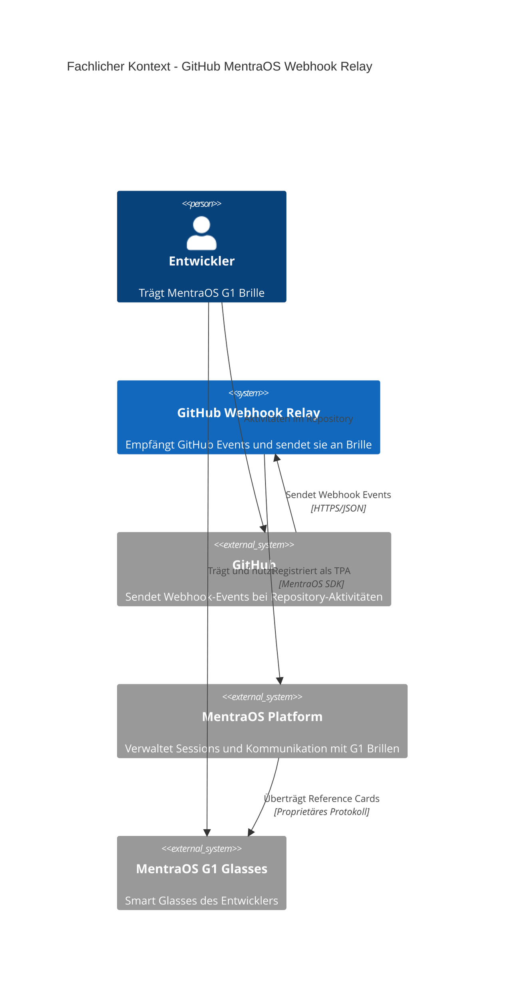

**Externe Schnittstellen:**

| Partner | Schnittstelle | Beschreibung |
|---------|---------------|--------------|
| GitHub | Webhook API | POST Requests mit Event-Daten und HMAC Signatur |
| MentraOS Platform | TPA SDK | Session-Management, Reference Card Display |
| G1 Glasses | Über MentraOS | Keine direkte Schnittstelle, Kommunikation über Platform |

## Technischer Kontext

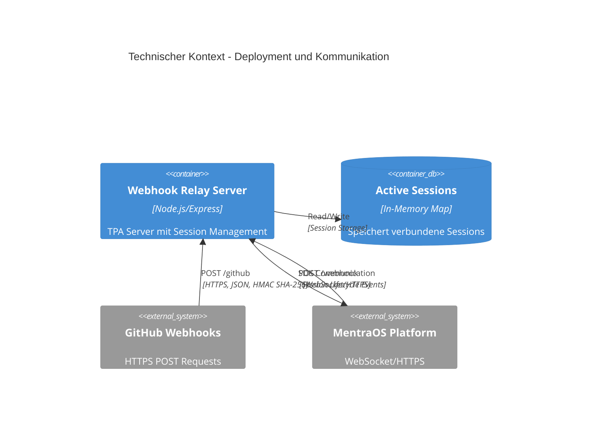

**Technische Schnittstellen:**

| Schnittstelle | Protokoll | Format | Authentifizierung |
|---------------|-----------|--------|-------------------|
| GitHub Webhook Endpoint | HTTPS POST | JSON oder URL-encoded | HMAC SHA-256 (X-Hub-Signature-256) |
| MentraOS SDK Webhook | HTTPS POST | JSON | MentraOS API Key |
| Status API | HTTPS GET | JSON | Keine (öffentlich) |
| Test Endpoints | HTTPS POST/GET | JSON | Keine (nur lokal) |

**Mapping fachliche auf technische Schnittstellen:**

- **GitHub Event → Reference Card**: GitHub Webhook wird empfangen, validiert, formatiert und via MentraOS SDK Session API als Reference Card angezeigt
- **Session Management**: MentraOS Platform ruft `/webhook` auf, SDK managed Session Lifecycle, App speichert Sessions in Memory Map
- **Monitoring**: Status-Endpoint liefert aktuelle Session-Informationen und Server-Status

# Lösungsstrategie

## Gesamtstrategie

Die Lösung basiert auf einer minimalistischen Single-File-Architektur mit folgenden Kernentscheidungen:

| Technologieentscheidung | Begründung |
|-------------------------|------------|
| **Node.js + Express** | Leichtgewichtig, event-driven, ideal für Webhook-Handling |
| **MentraOS TpaServer** | SDK abstrahiert Session-Management und Kommunikation mit Brillen |
| **In-Memory Session Storage** | Einfach, ausreichend für die Anforderungen, keine externe Datenbank nötig |
| **Single-File-Struktur (app.js)** | Übersichtlich für den Use Case, geringe Komplexität |
| **Environment Variables (.env)** | Sichere Konfiguration, keine Secrets im Code |
| **Inline Event Formatter** | Schnell anpassbar, keine externe Abhängigkeit |

## Architekturmuster

**Event-Driven Architecture:** 
- GitHub Events triggern Webhook Calls
- MentraOS Platform sendet Session Lifecycle Events
- Asynchrone Verarbeitung mit Promise-basiertem Flow

**Broadcast Pattern:**
- Ein GitHub Event wird an alle aktiven Sessions verteilt
- Fehlerbehandlung pro Session (ein Fehler blockiert nicht andere)

## Qualitätsansätze

| Qualitätsziel | Maßnahme |
|---------------|----------|
| Sicherheit | HMAC SHA-256 Signatur-Verifizierung für alle GitHub Webhooks |
| Zuverlässigkeit | Try-Catch Error Handling, detailliertes Logging, SDK-Workarounds |
| Wartbarkeit | Klare Struktur, umfangreiche Inline-Dokumentation, erkenntnisse*.md Dateien |
| Monitoring | Status-Endpoint, strukturiertes Logging mit Pino |

# Bausteinsicht

## Whitebox Gesamtsystem

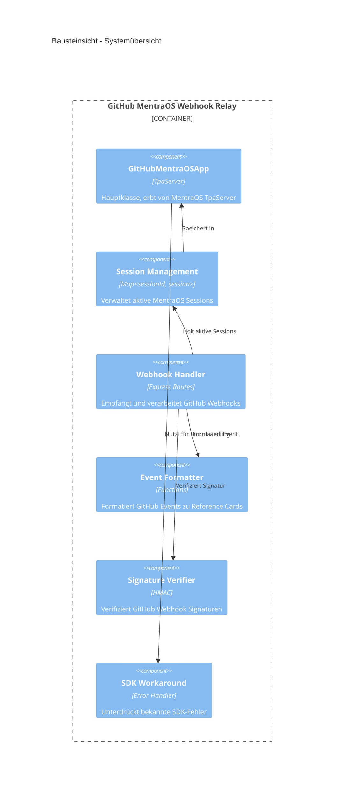

**Begründung:**
Die Architektur folgt dem Prinzip der Separation of Concerns:
- TpaServer kümmert sich um MentraOS SDK Integration
- Session Management isoliert Session-Verwaltungslogik
- Webhook Handler kapselt GitHub-spezifische Logik
- Formatter entkoppelt Darstellung von Business Logic
- Verifier isoliert Sicherheitslogik
- Workaround isoliert SDK-Probleme

**Enthaltene Bausteine:**

| Baustein | Verantwortung |
|----------|---------------|
| GitHubMentraOSApp | Hauptklasse, koordiniert alle Komponenten, erbt TpaServer Funktionalität |
| Session Management | Speichert aktive Sessions, verwaltet Lifecycle |
| Webhook Handler | Empfängt HTTP Requests, koordiniert Verarbeitung |
| Event Formatter | Transformiert GitHub Event JSON in lesbare Reference Cards |
| Signature Verifier | Validiert HMAC SHA-256 Signaturen von GitHub |
| SDK Workaround | Unterdrückt bekannte SDK-Fehler ohne Funktionalität zu beeinträchtigen |

**Wichtige Schnittstellen:**

| Schnittstelle | Beschreibung |
|---------------|--------------|
| `/github` | POST - Broadcast GitHub Event zu allen Sessions |
| `/github/:sessionId` | POST - GitHub Event zu spezifischer Session |
| `/status` | GET - Server Status und aktive Sessions |
| `/test/:sessionId` | POST - Test Reference Card senden |
| `/webhook` | POST - MentraOS SDK Webhook (automatisch) |
| `/health` | GET - Health Check |

### GitHubMentraOSApp (Hauptklasse)

**Zweck/Verantwortung:**
- Zentrale Orchestrierung aller Komponenten
- Erbt von MentraOS TpaServer
- Implementiert Session Lifecycle Hooks
- Koordiniert GitHub Webhook Processing

**Schnittstelle(n):**
```javascript
class GitHubMentraOSApp extends TpaServer {
  constructor()
  async onSession(session, sessionId, userId)
  async handleGitHubWebhook(sessionId, event, payload, signature)
  async handleGitHubWebhookBroadcast(event, payload, signature)
  verifyGitHubSignature(payload, signature)
  setupSDKErrorWorkaround()
}
```

**Ablageort:** `/app.js` (Zeilen 87-460)

**Erfüllte Anforderungen:**
- GitHub Webhook Empfang und Verarbeitung
- MentraOS Session Management
- Broadcast-Funktionalität an alle Geräte

### Session Management

**Zweck/Verantwortung:**
- Speicherung aktiver MentraOS Sessions
- Session Lifecycle Tracking (Connect/Disconnect)
- Aktivitäts-Tracking (Last Activity)

**Schnittstelle(n):**
```javascript
this.activeSessions = new Map();
// Map<sessionId, {session, sessionId, userId, connectedAt, lastActivity}>
```

**Ablageort:** `/app.js` (Zeile 99, verwendet in onSession/onDisconnected)

**Qualitäts-/Leistungsmerkmale:**
- In-Memory Storage: Schneller Zugriff, Sessions gehen bei Restart verloren
- O(1) Lookup Performance

### Webhook Handler

**Zweck/Verantwortung:**
- Express Route Definitionen
- HTTP Request Parsing (JSON und URL-encoded)
- Content-Type Handling
- Raw Body Capture für Signature Verification
- Response Formatting

**Schnittstelle(n):**
```javascript
// Express Routes (registriert in setupRoutes)
POST /github - Broadcast zu allen Sessions
POST /github/:sessionId - Zu spezifischer Session
GET /status - Server Status
POST /test/:sessionId - Test Message
GET /dashboard - HTML Dashboard
```

**Ablageort:** `/app.js` (setupRoutes Methode, Zeilen ~462-650)

### Event Formatter

**Zweck/Verantwortung:**
- Transformation von GitHub Event JSON zu Reference Card Format
- Unterstützung für verschiedene Event-Typen (push, pull_request, issues, etc.)
- Kompakte, lesbare Formatierung für Display auf Brille

**Schnittstelle(n):**
```javascript
function createCardFromEvent(event, payload)
// Returns: { title: string, body: string, durationSeconds: number }

function formatCommit(commit)
// Returns: string (formatted commit line)
```

**Ablageort:** `/app.js` (Zeilen 8-70)

**Unterstützte Events:**
- `push`: Commit-Liste mit Branch-Info
- `pull_request`: PR Details mit Status
- `issues`: Issue Details mit Action
- `default`: Generisches Event Format

### Signature Verifier

**Zweck/Verantwortung:**
- HMAC SHA-256 Signatur-Verifizierung
- Unterstützung für verschiedene Payload-Formate (Buffer, String, Object)
- Timing-Safe Comparison gegen Replay-Attacken

**Schnittstelle(n):**
```javascript
verifyGitHubSignature(payload, signature)
// Returns: boolean
```

**Ablageort:** `/app.js` (Methode in GitHubMentraOSApp)

**Qualitäts-/Leistungsmerkmale:**
- Timing-safe equal comparison (crypto.timingSafeEqual)
- Robust gegen verschiedene Input-Formate
- Detailliertes Logging für Debugging

### SDK Workaround

**Zweck/Verantwortung:**
- Unterdrückung bekannter harmloser SDK-Fehler
- Console Error Interception
- Process-Level Error Handler für uncaughtException und unhandledRejection

**Schnittstelle(n):**
```javascript
setupSDKErrorWorkaround()
// Installiert Error Handler

process.on('uncaughtException', handler)
process.on('unhandledRejection', handler)
```

**Ablageort:** `/app.js` (Zeilen 124-142, 670-705)

**Offene Punkte/Probleme/Risiken:**
- Temporärer Workaround, sollte entfernt werden wenn SDK aktualisiert wird
- Markiert mit TODO-Kommentaren

## Ebene 2

### Whitebox *Session Management*

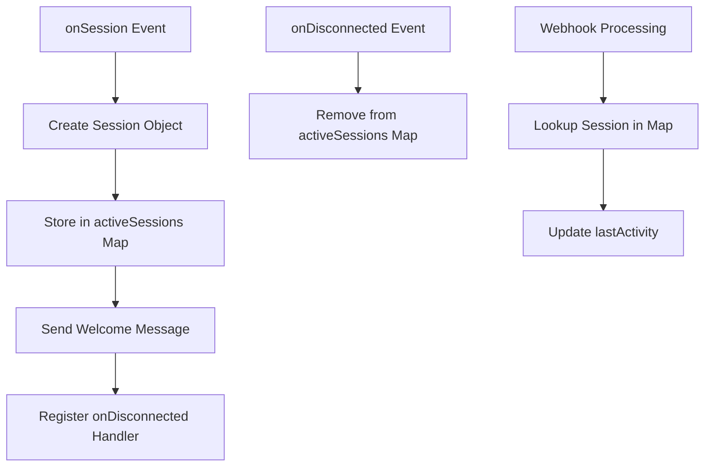

**Struktur:**
```javascript
activeSessions: Map<sessionId, {
  session: TpaSession,        // MentraOS Session Object
  sessionId: string,           // Unique Session ID
  userId: string,              // MentraOS User ID
  connectedAt: ISO8601,        // Connection Timestamp
  lastActivity: ISO8601        // Last Activity Timestamp
}>
```

**Lifecycle:**
1. **Connect:** `onSession()` → Session speichern, Welcome Message senden
2. **Activity:** Webhook Processing → `lastActivity` updaten
3. **Disconnect:** `onDisconnected()` → Session aus Map entfernen

### Whitebox *Webhook Handler*

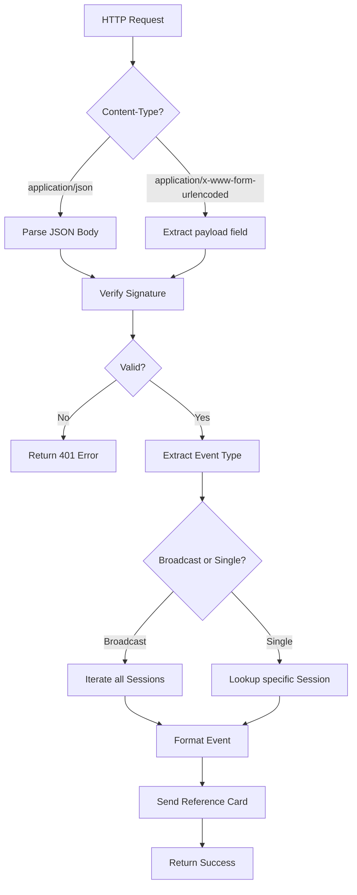

**Body Parsing:**
- Express `json()` Middleware mit `verify` Hook für Raw Body Capture
- Express `urlencoded()` Middleware für URL-encoded Webhooks
- `req.rawBody` speichert originalen Buffer für Signature Verification

**Error Handling:**
- 401 bei Invalid Signature
- 404 bei Session nicht gefunden
- 500 bei internen Fehlern
- Detailliertes Logging bei jedem Fehler

## Ebene 3

*Keine weitere Vertiefung notwendig auf dieser Ebene - die Komponenten sind ausreichend granular*

# Laufzeitsicht

## GitHub Webhook Broadcast Flow

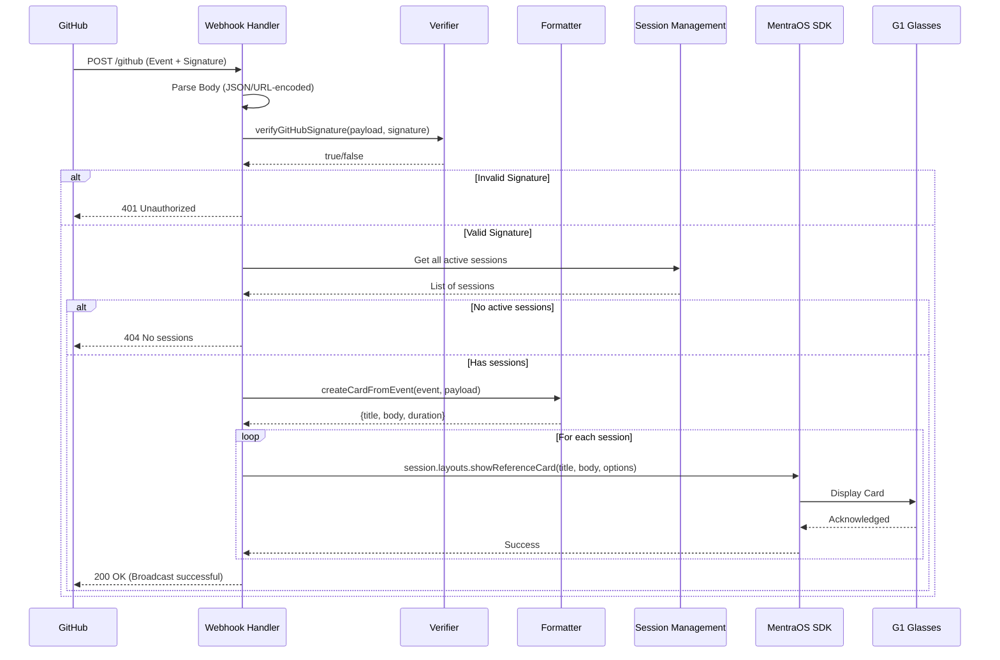

**Besonderheiten:**
- Parallele Verarbeitung mehrerer Sessions (async/await mit try-catch pro Session)
- Ein Session-Fehler blockiert nicht andere Sessions
- Detailliertes Logging bei jedem Schritt

## Session Lifecycle

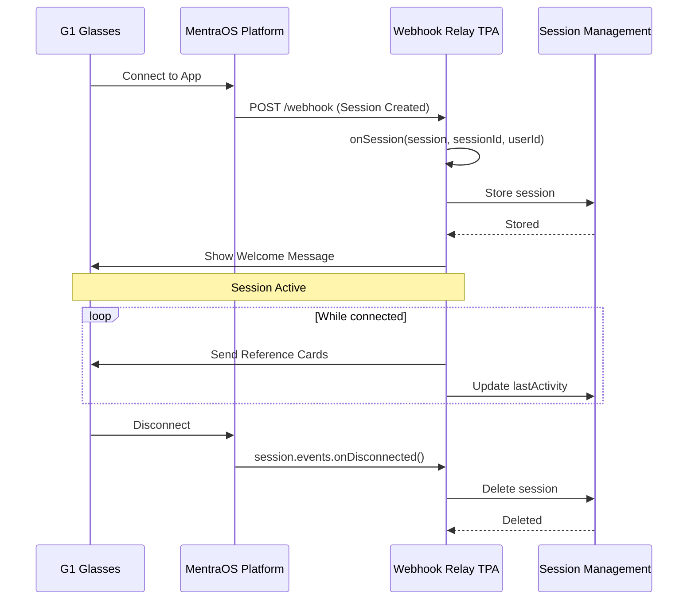

## Signature Verification Flow

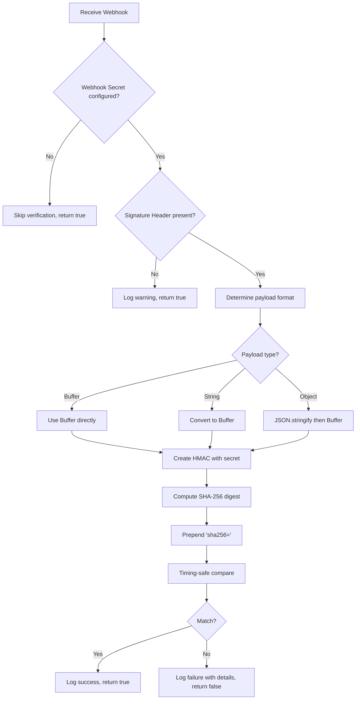

# Verteilungssicht

## Infrastruktur Ebene 1

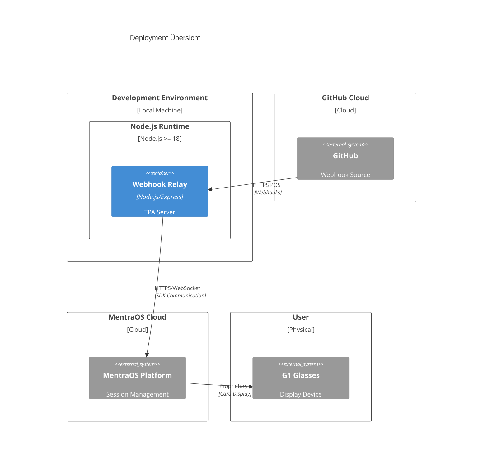

**Begründung:**
- **Development Environment:** Lokaler Server für Entwicklung mit ngrok für öffentliche Erreichbarkeit
- **Production:** Kann auf beliebiger Cloud-Plattform (Azure, AWS, GCP) gehostet werden
- **GitHub/MentraOS Cloud:** Externe Abhängigkeiten, kein Einfluss auf Deployment

**Qualitäts- und/oder Leistungsmerkmale:**
- **Skalierbarkeit:** Single-Instance, In-Memory Sessions (nicht horizontal skalierbar)
- **Verfügbarkeit:** Abhängig von Hosting-Plattform
- **Latenz:** Geringe Latenz durch direkte SDK-Kommunikation

**Zuordnung von Bausteinen zu Infrastruktur:**
- `GitHubMentraOSApp` → Node.js Runtime
- `activeSessions` (In-Memory Map) → Node.js Prozess Memory
- Express Server → Port 3000 (konfigurierbar)

## Infrastruktur Ebene 2

### Development Setup

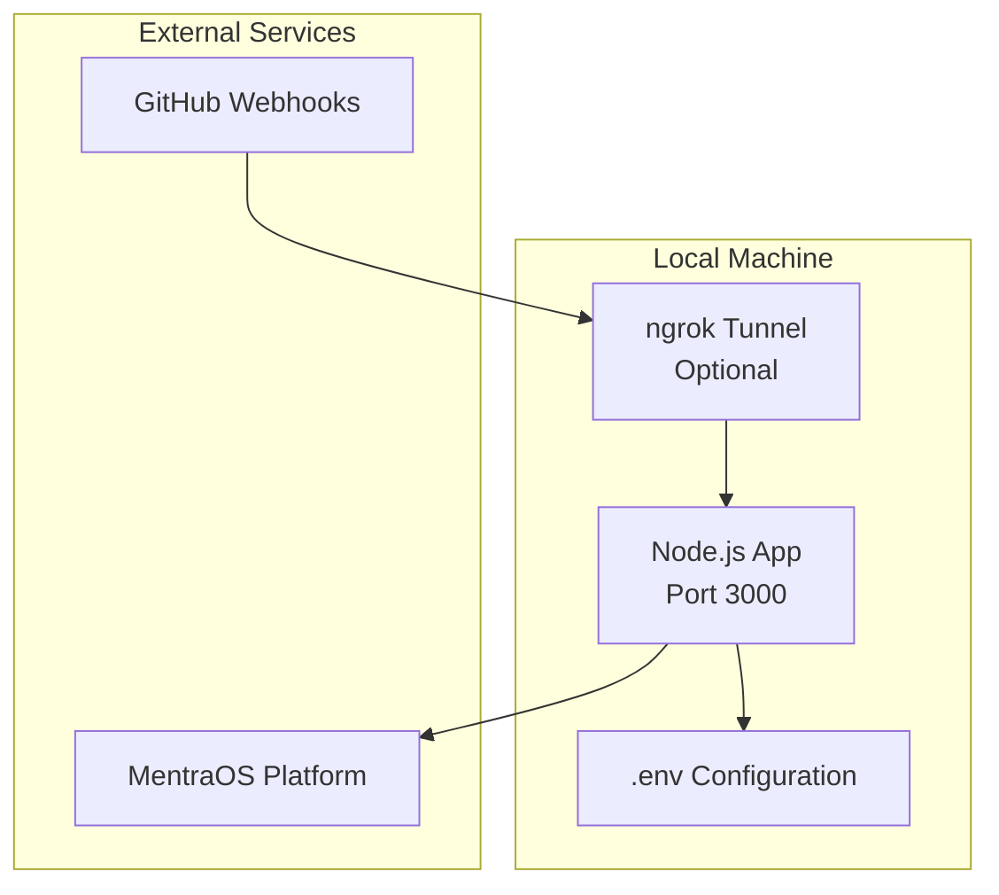

**Konfiguration:**
- `.env` Datei mit API Keys und Secrets
- `npm install` für Dependencies
- `npm start` oder `npm run dev` (mit nodemon)
- Optional: ngrok für öffentliche URL

**Port-Mapping:**
- Local: `localhost:3000`
- Ngrok: `https://<random>.ngrok.io` → `localhost:3000`

### Production Deployment (Beispiel: Cloud VM)

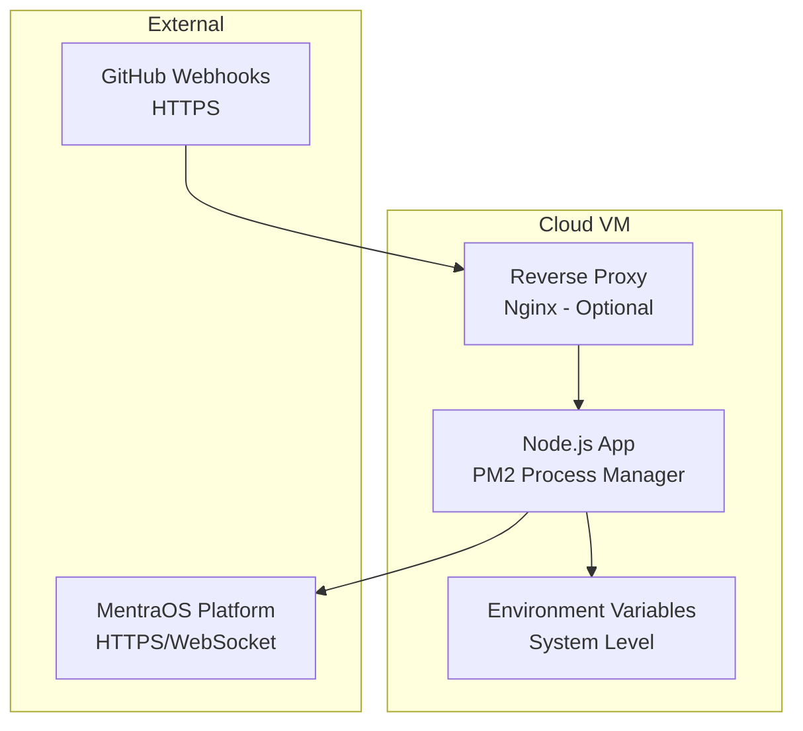

**Komponenten:**
- **PM2:** Process Manager für Auto-Restart und Logging
- **Nginx:** Optional als Reverse Proxy für SSL/TLS Termination
- **Environment Variables:** System-level statt .env Datei

# Querschnittliche Konzepte

## Logging

**Konzept:**
- Strukturiertes Logging mit Pino Logger (vom MentraOS SDK bereitgestellt)
- Emoji-basierte Präfixe für bessere Lesbarkeit
- Verschiedene Log-Levels (info, warn, error)

**Beispiele:**
```javascript
this.logger.info(`🔵 New MentraOS session: ${sessionId}`);
this.logger.error(`❌ Failed to send reference card: ${error.message}`);
console.log(`✅ Welcome message sent to ${sessionId}`);
```

**Log-Kategorien:**
- 🔧 Initialisierung
- 🔵 Session Events
- 🔴 Disconnects
- 🎯 Webhook Events
- 🃏 Card Creation
- ✅ Erfolge
- ❌ Fehler
- 🔇 Workaround Suppressions

## Error Handling

**Strategie:**
- Try-Catch Blöcke in allen async Funktionen
- Detailliertes Error Logging mit Context
- Graceful Degradation (einzelne Session-Fehler blockieren nicht Broadcast)
- Process-Level Handler für uncaught Exceptions

**Fehlertypen:**
- **Authentication Errors:** 401 bei invalid Signature
- **Not Found Errors:** 404 bei Session nicht gefunden
- **SDK Errors:** Suppressions durch Workaround
- **Internal Errors:** 500 mit Stack Trace

## Security

### HMAC Signature Verification

**Zweck:** Validierung dass Webhooks tatsächlich von GitHub kommen

**Implementierung:**
```javascript
verifyGitHubSignature(payload, signature) {
  const hmac = crypto.createHmac('sha256', this.webhookSecret);
  const digest = 'sha256=' + hmac.update(payload).digest('hex');
  return crypto.timingSafeEqual(Buffer.from(signature), Buffer.from(digest));
}
```

**Besonderheiten:**
- Timing-safe Comparison gegen Timing Attacks
- Support für verschiedene Payload-Formate (Buffer/String/Object)
- Optional (übersprungen wenn kein Secret konfiguriert)

### API Key Management

**Konzept:**
- Secrets in `.env` Datei (nicht in Git)
- Environment Variables für Production
- Validierung beim Server-Start

**Required:**
- `MENTRAOS_API_KEY` - Mandatory
- `GITHUB_WEBHOOK_SECRET` - Optional aber empfohlen

## Configuration Management

**Strategie:** Environment Variables via dotenv

**Konfigurationsparameter:**
```bash
MENTRAOS_API_KEY=<required>          # MentraOS API Key
PACKAGE_NAME=<optional>              # Default: com.mentraos.github-webhook-relay
PORT=<optional>                      # Default: 3000
GITHUB_WEBHOOK_SECRET=<optional>     # Für Signature Verification
```

**Defaults:**
- Alle optionalen Parameter haben sinnvolle Defaults
- Server startet nicht ohne `MENTRAOS_API_KEY`

## Session Management Pattern

**Lifecycle:**
1. **Connect:** Session wird in Map gespeichert mit Timestamps
2. **Active:** `lastActivity` wird bei jedem Webhook aktualisiert
3. **Disconnect:** Session wird automatisch entfernt (onDisconnected Handler)

**In-Memory Storage:**
- Vorteile: Schnell, einfach, keine externe Dependency
- Nachteile: Sessions gehen bei Server-Restart verloren
- Ausreichend für den aktuellen Use Case

## Event Processing Pattern

**Broadcast Pattern:**
```javascript
for (const [sessionId, storedSession] of this.activeSessions) {
  try {
    await storedSession.session.layouts.showReferenceCard(...);
  } catch (error) {
    // Log error but continue with other sessions
    this.logger.error(`Failed for session ${sessionId}:`, error);
  }
}
```

**Vorteile:**
- Ein Fehler blockiert nicht andere Sessions
- Parallele Verarbeitung möglich
- Klares Error Reporting pro Session

# Architekturentscheidungen

## ADR-001: Single-File Architektur

**Status:** Akzeptiert

**Kontext:** 
Ursprünglich Azure Functions mit komplexer Ordnerstruktur. Migration zu MentraOS TPA erforderte Neustrukturierung.

**Entscheidung:** 
Komplette App in einer einzigen `app.js` Datei (~740 Zeilen).

**Begründung:**
- Use Case ist überschaubar (GitHub Webhooks → MentraOS)
- Keine komplexe Business Logic
- Einfacher zu verstehen und zu warten
- Keine Notwendigkeit für Module-Splitting

**Konsequenzen:**
- ✅ Einfache Navigation
- ✅ Keine Import-Probleme
- ✅ Schnelle Entwicklung
- ⚠️ Bei Wachstum auf >1000 Zeilen refactoring nötig

## ADR-002: In-Memory Session Storage

**Status:** Akzeptiert

**Kontext:** 
Sessions müssen gespeichert werden um Webhooks zu routen.

**Entscheidung:** 
JavaScript Map als In-Memory Storage.

**Alternativen:**
- Redis (zu komplex für den Use Case)
- SQLite (Overhead nicht gerechtfertigt)
- File-based (langsam, kompliziert)

**Begründung:**
- Ausreichend für aktuelle Anforderungen
- Keine persistenten Daten nötig
- Sessions werden bei Disconnect sowieso invalid
- O(1) Lookup Performance

**Konsequenzen:**
- ✅ Einfach, schnell, keine Dependencies
- ⚠️ Sessions gehen bei Server-Restart verloren
- ⚠️ Nicht horizontal skalierbar

## ADR-003: SDK Error Workaround

**Status:** Temporär akzeptiert

**Kontext:** 
MentraOS SDK (aktuelle Version) wirft Fehler für `capabilities_update` Message Type.

**Entscheidung:** 
Workaround implementieren der diese spezifischen Fehler unterdrückt.

**Alternativen:**
- SDK Downgrade (verliert neue Features)
- Fehler ignorieren (Log Pollution)
- Auf SDK Fix warten (unbefriedigende User Experience)

**Begründung:**
- Fehler ist harmlos (beeinflusst Funktionalität nicht)
- SDK Update nicht sofort verfügbar
- Workaround ist sauber isoliert und dokumentiert

**Konsequenzen:**
- ✅ Saubere Logs
- ✅ Klar dokumentiert und auffindbar (TODO Kommentare)
- ⚠️ Muss entfernt werden bei SDK Update
- ⚠️ Könnte echte Fehler maskieren (durch präzise Filterung minimiert)

**TODO:** Entfernen wenn SDK `capabilities_update` unterstützt

## ADR-004: Broadcast statt Session-basiertes Routing

**Status:** Akzeptiert

**Kontext:** 
GitHub Webhooks kennen keine Session-ID der Brille.

**Entscheidung:** 
Broadcast-Endpoint `/github` der an alle aktiven Sessions sendet.

**Alternativen:**
- Session-basierter Endpoint mit manueller Session-ID Eingabe
- User-Mapping (GitHub User → Session)

**Begründung:**
- Session-ID ist nicht beim Webhook-Setup bekannt
- Broadcast ist einfacher (keine Mapping-Logik nötig)
- Typischer Use Case: Ein Entwickler trägt die Brille

**Konsequenzen:**
- ✅ Einfache GitHub Webhook Konfiguration
- ✅ Funktioniert out-of-the-box
- ⚠️ Bei mehreren verbundenen Brillen erhalten alle die Nachricht

## ADR-005: HMAC Signature Verification Optional

**Status:** Akzeptiert

**Kontext:** 
GitHub empfiehlt Signature Verification, aber nicht alle Setups haben Secrets.

**Entscheidung:** 
Verification wird durchgeführt wenn Secret konfiguriert ist, sonst übersprungen.

**Begründung:**
- Development/Testing ohne Secret möglich
- Production sollte immer Secret nutzen
- Flexible für verschiedene Deployment-Szenarien

**Konsequenzen:**
- ✅ Einfaches lokales Testing
- ✅ Sicher in Production (mit Secret)
- ⚠️ Entwickler muss an Secret denken

# Qualitätsanforderungen

Siehe [Qualitätsanforderungen](https://docs.arc42.org/section-10/) in
der online-Dokumentation (auf Englisch!).

## Qualitätsbaum

```
Qualität
├── Funktionalität
│   ├── GitHub Webhook Empfang (HOCH)
│   ├── Signature Verification (HOCH)
│   ├── Event Formatting (MITTEL)
│   └── Broadcast zu Sessions (HOCH)
├── Zuverlässigkeit
│   ├── Stabile Session Verwaltung (HOCH)
│   ├── Error Recovery (MITTEL)
│   └── Logging/Monitoring (MITTEL)
├── Sicherheit
│   ├── HMAC Verification (HOCH)
│   ├── API Key Protection (HOCH)
│   └── No Secrets in Code (HOCH)
├── Wartbarkeit
│   ├── Code-Lesbarkeit (HOCH)
│   ├── Dokumentation (HOCH)
│   └── Workaround-Isolation (MITTEL)
├── Performance
│   ├── Webhook Response Time (MITTEL)
│   ├── Session Lookup (MITTEL)
│   └── Memory Usage (NIEDRIG)
└── Usability
    ├── Kompakte Card-Formatierung (HOCH)
    ├── Status Monitoring (MITTEL)
    └── Setup-Einfachheit (HOCH)
```

## Qualitätsszenarien

### QS-1: GitHub Webhook Verarbeitung

**Szenario:** GitHub sendet Webhook bei Push Event

**Stimulus:** POST Request mit push Event und 3 Commits

**Erwartete Reaktion:** 
- Signature wird verifiziert
- Event wird formatiert mit Commit-Liste
- Card wird an alle verbundenen Brillen gesendet
- Response 200 OK innerhalb von 2 Sekunden

**Metriken:**
- Response Time: < 2s
- Success Rate: > 99%
- Alle verbundenen Sessions erhalten Card

### QS-2: Invalid Signature Rejection

**Szenario:** Angreifer sendet gefälschten Webhook

**Stimulus:** POST Request mit falscher Signatur

**Erwartete Reaktion:**
- Signatur-Verifizierung schlägt fehl
- Request wird mit 401 abgelehnt
- Detailliertes Error Logging
- Keine Card wird gesendet

**Metriken:**
- 100% Rejection Rate bei falscher Signatur
- Response Time: < 500ms
- Kein False Positive (echte Webhooks nicht abgelehnt)

### QS-3: SDK Error Workaround

**Szenario:** MentraOS Platform sendet `capabilities_update` Message

**Stimulus:** WebSocket Message mit unbekanntem Type

**Erwartete Reaktion:**
- Error wird vom Workaround abgefangen
- Log-Meldung über Suppression
- App läuft weiter normal
- Funktionalität nicht beeinträchtigt

**Metriken:**
- 0 Crashes durch SDK Errors
- Log Pollution minimiert
- Funktionalität bleibt 100% verfügbar

### QS-4: Session Disconnect und Reconnect

**Szenario:** Brille verliert Verbindung und verbindet neu

**Stimulus:** Disconnect Event gefolgt von neuem Connect

**Erwartete Reaktion:**
- Alte Session wird aus Map entfernt
- Neue Session wird korrekt registriert
- Welcome Message wird gesendet
- Neue Webhooks erreichen neue Session

**Metriken:**
- Session Cleanup Time: < 1s
- Keine Memory Leaks
- Neue Session sofort erreichbar

### QS-5: Broadcast Performance

**Szenario:** Webhook Broadcast an 5 verbundene Brillen

**Stimulus:** POST /github mit Event

**Erwartete Reaktion:**
- Event wird parallel an alle Sessions gesendet
- Fehler bei einer Session blockiert nicht andere
- Alle erfolgreichen Sends werden geloggt
- Response enthält Success Count

**Metriken:**
- Total Time: < 3s für 5 Sessions
- Parallelität: Async Verarbeitung
- Isolation: 100% (ein Fehler blockiert nicht andere)

# Risiken und technische Schulden

## Technische Schulden

### TD-1: SDK Error Workaround

**Beschreibung:** 
Console Error Interceptor und Process-Level Error Handler für `capabilities_update` SDK-Fehler.

**Standort:** 
- `app.js` - Zeilen 124-142 (setupSDKErrorWorkaround)
- `app.js` - Zeilen 670-705 (Process Error Handlers)

**Ursache:** 
MentraOS SDK Version 1.0.0 unterstützt `capabilities_update` Message Type nicht.

**Impact:** 
- Code-Komplexität erhöht
- Könnte echte Fehler maskieren (durch präzise Filter minimiert)
- Wartungsaufwand

**Maßnahme:** 
- Regelmäßig SDK Updates prüfen
- Workaround entfernen sobald SDK `capabilities_update` unterstützt
- Alle Stellen markiert mit `TODO: Remove when SDK supports capabilities_update`

**Priorität:** MITTEL

---

### TD-2: In-Memory Session Storage

**Beschreibung:** 
Sessions werden in JavaScript Map gespeichert, gehen bei Server-Restart verloren.

**Standort:** 
`app.js` - Zeile 99 (`this.activeSessions = new Map()`)

**Ursache:** 
Einfachheit priorisiert, keine persistente Storage-Lösung implementiert.

**Impact:** 
- Sessions müssen nach Restart neu verbunden werden
- Nicht horizontal skalierbar
- Kein Session-Recovery nach Crash

**Maßnahme (optional):** 
Bei Bedarf auf Redis oder SQLite migrieren für:
- Session Persistence
- Horizontale Skalierung
- Session-Recovery

**Priorität:** NIEDRIG (aktuell ausreichend)

---

### TD-3: Fehlende Unit Tests

**Beschreibung:** 
Keine automatisierten Tests für kritische Komponenten.

**Standort:** 
`package.json` - Script "test" gibt Error aus

**Ursache:** 
Fokus auf schnelle Entwicklung, manuelle Tests durchgeführt.

**Impact:** 
- Regression-Risiko bei Änderungen
- HMAC Verification sollte getestet sein
- Event Formatter sollte getestet sein

**Maßnahme:** 
Unit Tests hinzufügen für:
- `verifyGitHubSignature()`
- `createCardFromEvent()`
- Session Management Logik

**Priorität:** MITTEL

---

### TD-4: Dokumentations-Redundanz

**Beschreibung:** 
Informationen sind über mehrere Dateien verteilt (README, erkenntnisse1.md, erkenntnisse2.md, SDK-ERRORS.md, WORKAROUND-SDK-ERRORS.md).

**Standort:** 
Verschiedene Markdown-Dateien im Root

**Ursache:** 
Iterative Entwicklung, Erkenntnisse dokumentiert während der Problemlösung.

**Impact:** 
- Schwer zu navigieren
- Informationen teilweise doppelt
- Wartungsaufwand

**Maßnahme:** 
Diese arc42 Dokumentation konsolidiert alle Informationen. Alte Dateien können archiviert oder gelöscht werden.

**Priorität:** NIEDRIG (mit dieser arc42 Doku gelöst)

## Risiken

### R-1: MentraOS SDK Stabilität

**Beschreibung:** 
SDK wirft Fehler für neue Message Types, API-Signaturen waren nicht konsistent.

**Wahrscheinlichkeit:** MITTEL

**Impact:** HOCH (könnte App funktionsunfähig machen)

**Maßnahmen:**
- ✅ Workaround implementiert
- SDK Updates regelmäßig prüfen
- Ausführliche Logs für Debugging
- Dokumentation der SDK-Probleme

**Status:** MITIGIERT

---

### R-2: Session Verlust bei Restart

**Beschreibung:** 
Alle Sessions gehen verloren wenn Server neu startet.

**Wahrscheinlichkeit:** MITTEL (bei Deployment/Maintenance)

**Impact:** MITTEL (User müssen App neu öffnen)

**Maßnahmen:**
- Dokumentiert im README
- Welcome Message erklärt Session
- Bei Bedarf: Persistent Storage implementieren

**Status:** AKZEPTIERT

---

### R-3: GitHub Webhook Delivery Failure

**Beschreibung:** 
GitHub könnte Webhooks nicht zustellen wenn Server nicht erreichbar.

**Wahrscheinlichkeit:** NIEDRIG

**Impact:** MITTEL (Events gehen verloren)

**Maßnahmen:**
- Health Check Endpoint für Monitoring
- GitHub Webhook Delivery Log prüfen
- Bei Bedarf: Retry Queue implementieren

**Status:** AKZEPTIERT (GitHub hat eigenes Retry-Mechanism)

---

### R-4: HMAC Verification Bypass

**Beschreibung:** 
Wenn kein Webhook Secret konfiguriert ist, wird Verification übersprungen.

**Wahrscheinlichkeit:** NIEDRIG (nur bei Fehlkonfiguration)

**Impact:** HOCH (Unautorisierte Webhooks möglich)

**Maßnahmen:**
- Dokumentiert in README und .env.template
- Logging warnt wenn kein Secret
- Production Deployment sollte Secret erfordern

**Status:** DOKUMENTIERT

---

### R-5: Memory Leak bei vielen Verbindungen

**Beschreibung:** 
Bei vielen Connect/Disconnect Zyklen könnte Session Cleanup fehlschlagen.

**Wahrscheinlichkeit:** NIEDRIG

**Impact:** MITTEL (erhöhter Memory-Verbrauch)

**Maßnahmen:**
- onDisconnected Handler registriert
- Sessions werden explizit gelöscht
- Bei Bedarf: Session Timeout implementieren

**Status:** BEOBACHTET (bisher keine Probleme)

# Glossar

| Begriff | Definition |
|---------|------------|
| **TPA** | Third-Party App - MentraOS Begriff für externe Anwendungen die das SDK nutzen |
| **TpaServer** | MentraOS SDK Klasse für Server-seitige Apps mit Session Management |
| **TpaSession** | MentraOS SDK Klasse die eine Verbindung zu einer G1 Brille repräsentiert |
| **Reference Card** | Display-Format für kurze Textnachrichten auf MentraOS G1 Brillen |
| **G1 Glasses** | Smart Glasses von Even Realities mit MentraOS Software |
| **Webhook** | HTTP Callback - GitHub sendet POST Requests bei Repository Events |
| **HMAC** | Hash-based Message Authentication Code - Signaturverfahren für Webhooks |
| **Session** | Verbindung zwischen einer G1 Brille und der TPA App |
| **Session ID** | Eindeutige Kennung für eine aktive Session |
| **Broadcast** | Senden einer Nachricht an alle aktiven Sessions gleichzeitig |
| **Package Name** | Eindeutige Kennung für die MentraOS App (z.B. "com.mentraos.github-webhook-relay") |
| **SDK** | Software Development Kit - MentraOS SDK für Third-Party Apps |
| **capabilities_update** | MentraOS Message Type für Geräte-Capabilities (Display, Mikrofon, etc.) |
| **Workaround** | Temporäre Code-Lösung für SDK-Probleme (markiert mit TODO) |
| **dotenv** | Node.js Library zum Laden von Environment Variables aus .env Datei |
| **Express** | Node.js Web-Framework für HTTP Server |
| **Pino** | Strukturiertes Logging Framework (vom MentraOS SDK verwendet) |
| **ngrok** | Tool zum Erstellen öffentlicher URLs für lokale Server (für Webhook Testing) |
| **SHA-256** | Kryptographische Hash-Funktion für Signatur-Verifizierung |
| **Timing-safe Equal** | Vergleichsoperation die Timing-Attacks verhindert |
| **Raw Body** | Unverarbeiteter Request Body als Buffer für Signatur-Verifizierung |
| **URL-encoded** | Content-Type für form-basierte HTTP Requests (GitHub Webhook Alternative) |
