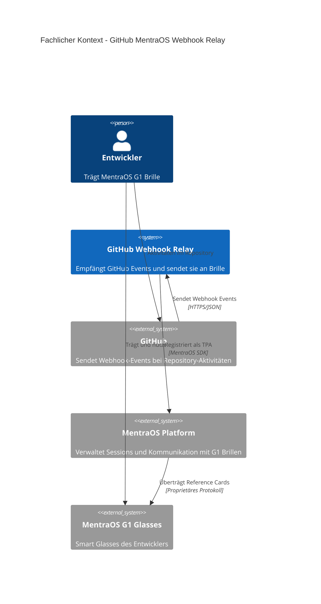
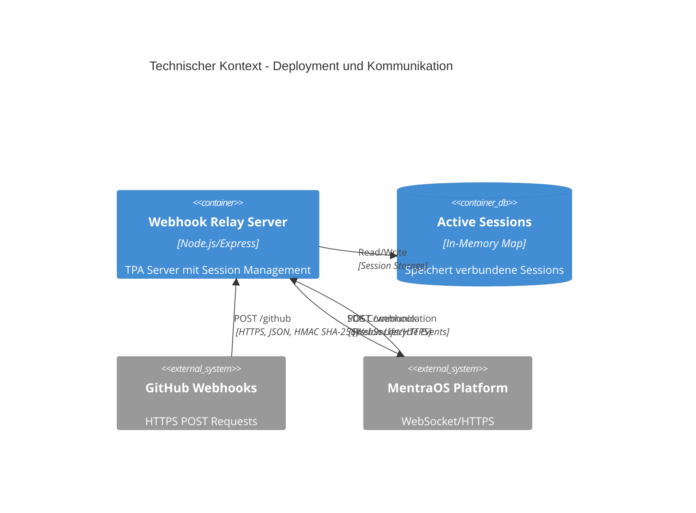
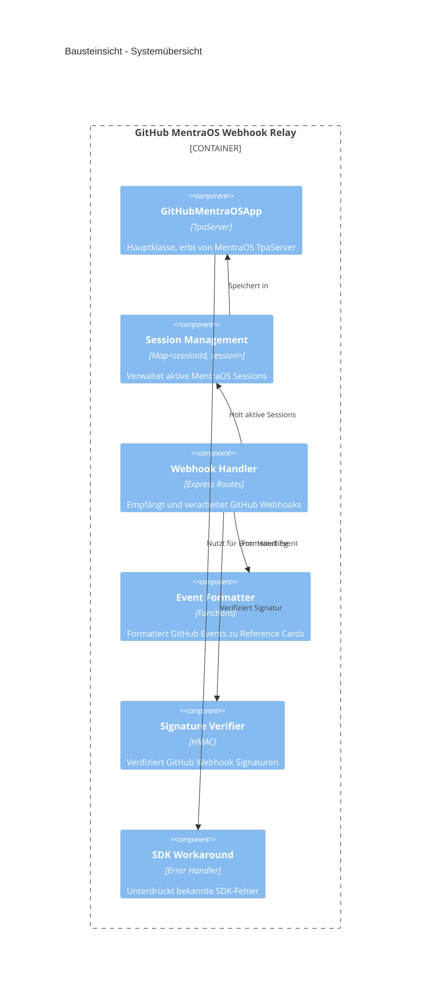
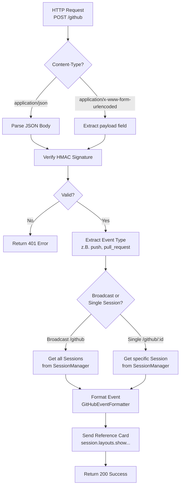
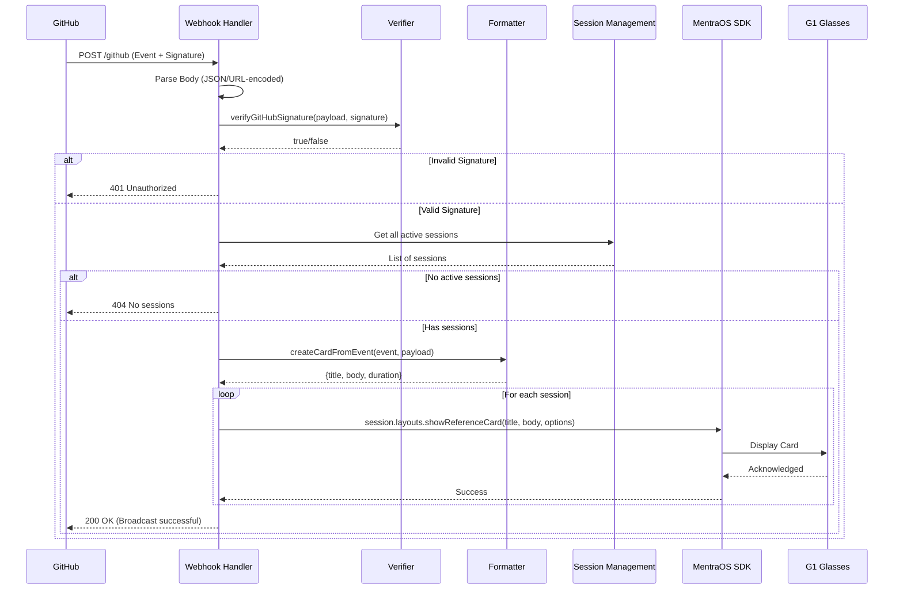
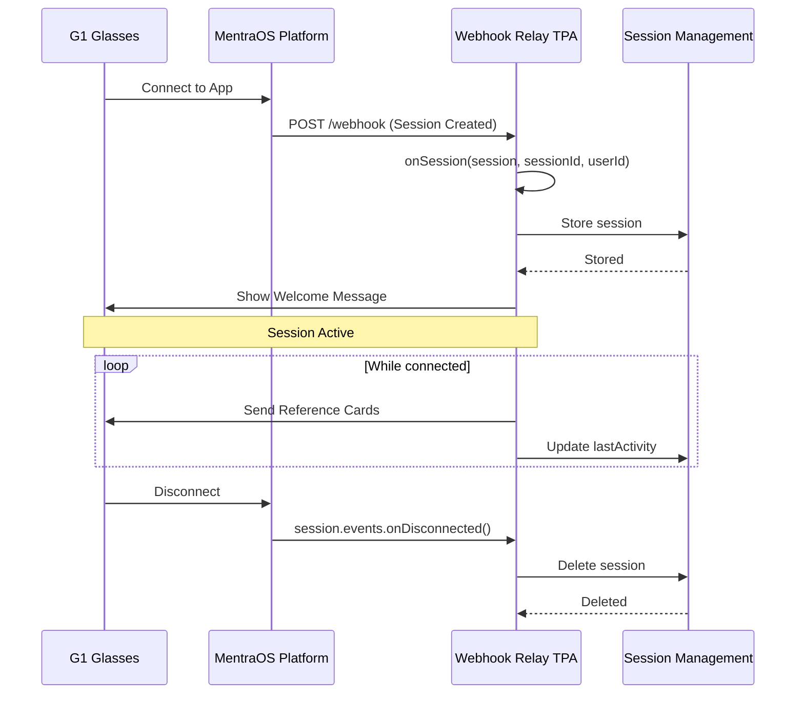
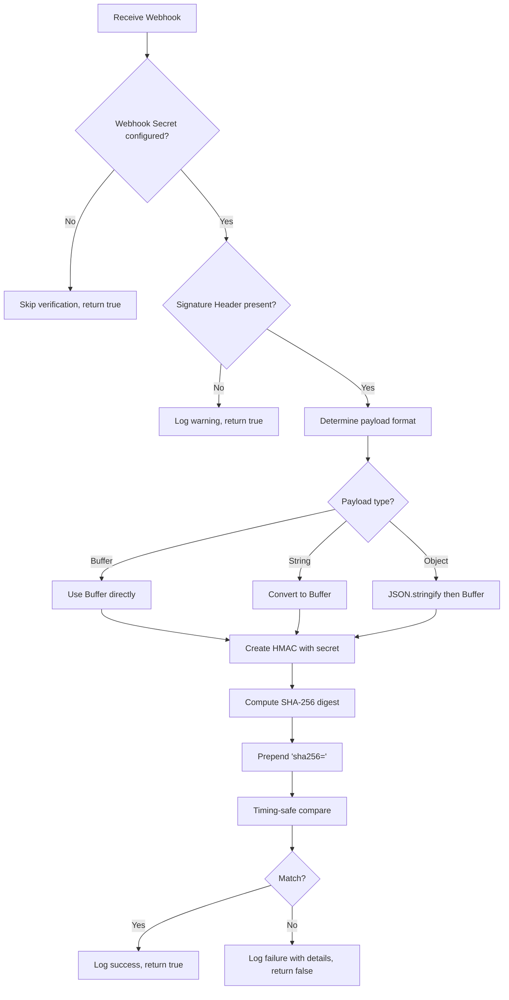
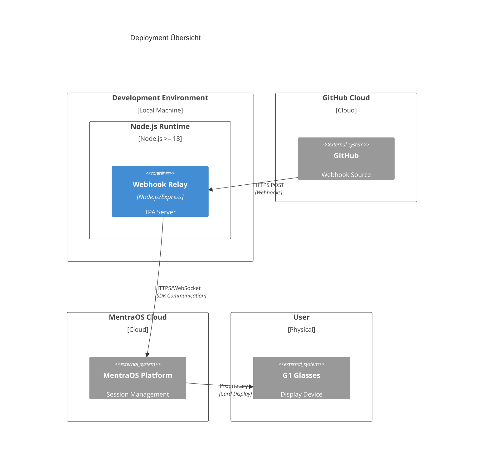
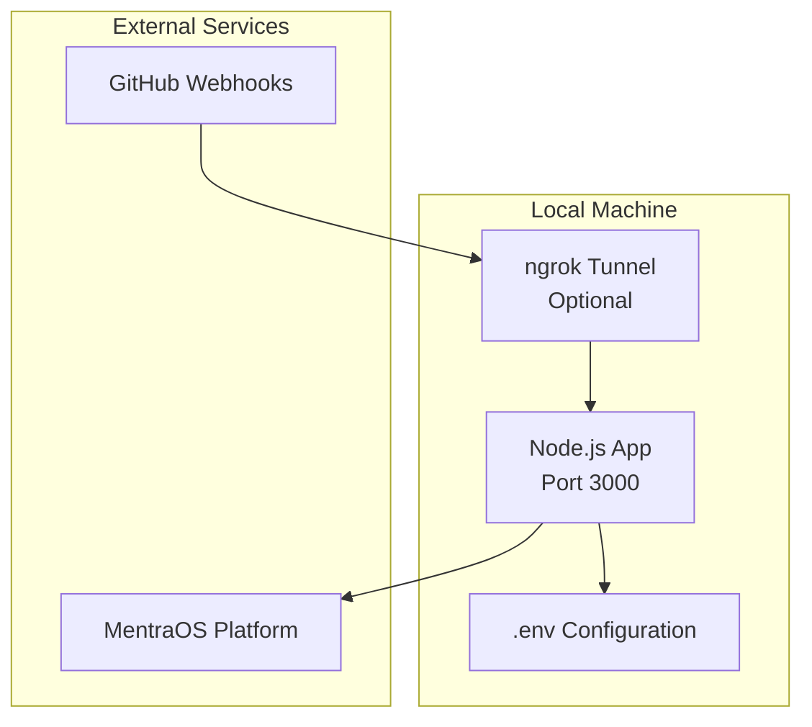
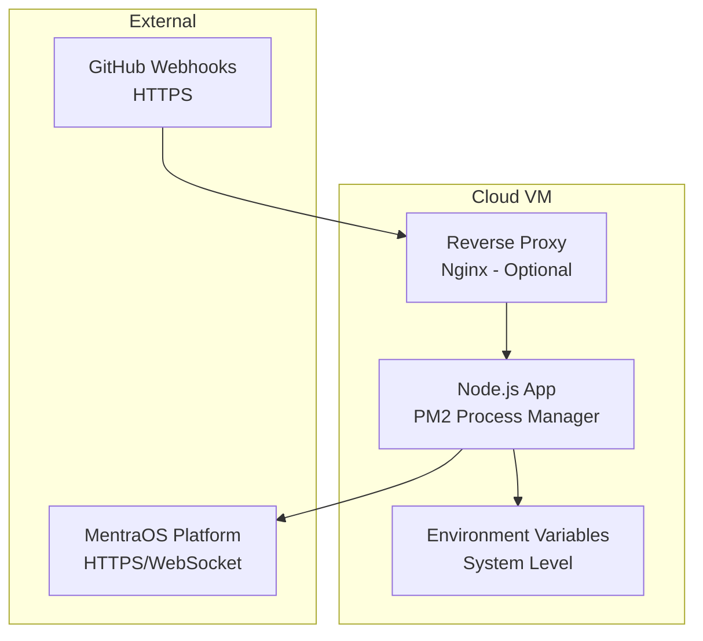

# GitHub MentraOS Webhook Relay - Architekturdokumentation

**Status:** ✅ Aktualisiert Januar 2026 - Architektur abgestimmt mit Codebase

**Über arc42**

arc42, das Template zur Dokumentation von Software- und
Systemarchitekturen.

Template Version 8.2 DE. (basiert auf AsciiDoc Version), Januar 2023

Created, maintained and © by Dr. Peter Hruschka, Dr. Gernot Starke and
contributors. Siehe <https://arc42.org>.

---

## ⚡ Quick Facts (für Eilige)

| Aspekt | Details |
|--------|---------|
| **Architektur-Typ** | Modulare 4-Modul Struktur mit Dependency Injection |
| **Code-Basis** | Node.js 18+ (468 Zeilen app.js + 3 Module = ~740 Zeilen total) |
| **Deployment** | Development/Small Teams (Single-Instance, In-Memory Sessions) |
| **Sicherheit** | HMAC SHA-256 Signature Verification, Timing-safe Comparison |
| **Setup-Zeit** | 5-10 Minuten (npm install + .env Configuration) |
| **Production-Ready** | ✅ Ja (mit Caveats - siehe Limitations) |
| **Horizontale Skalierung** | ❌ Nein (In-Memory Sessions, kein Session-Sharing) |
| **Bekannte Issues** | 🟡 SDK v1.0.0 capabilities_update Error (dokumentiert + Workaround) |

---

# Einführung und Ziele

## Aufgabenstellung

Das System empfängt GitHub Webhooks und leitet diese als Reference Cards an MentraOS G1 Smart Glasses weiter. Die Anwendung fungiert als Relay-Server zwischen GitHub und den tragbaren Geräten, um Entwickler in Echtzeit über Repository-Ereignisse zu informieren.

**Hauptfunktionen:**
- Empfang von GitHub Webhook-Benachrichtigungen (Push, Pull Request, Issues, etc.)
- Verifikation der Webhook-Signaturen mittels HMAC SHA-256
- Formatierung der Ereignisse in kompakte, lesbare Reference Cards
- Broadcasting an alle verbundenen MentraOS G1 Brillen
- Session-Management für verbundene Geräte
- Status-Monitoring und Health-Check-Endpoints

## Qualitätsziele

| Priorität | Qualitätsziel | Beschreibung |
|-----------|---------------|--------------|
| 1 | Zuverlässigkeit | Alle GitHub Webhooks müssen zuverlässig empfangen und an verbundene Geräte weitergeleitet werden |
| 2 | Sicherheit | Webhook-Signaturen müssen verifiziert werden; keine unauthorisierten Zugriffe |
| 3 | Verfügbarkeit | Server muss kontinuierlich laufen und Sessions stabil halten |
| 4 | Wartbarkeit | Einfache, minimalistische Architektur; gut dokumentierte Workarounds |
| 5 | Benutzerfreundlichkeit | Kompakte, lesbare Formatierung der Ereignisse für die Brille |

## Stakeholder

| Rolle        | Kontakt        | Erwartungshaltung |
|--------------|----------------|-------------------|
| Entwickler | Nutzer der Brille | Erhalten Echtzeit-Benachrichtigungen über GitHub-Ereignisse auf ihrer G1 Brille |
| Administrator | System-Betreiber | Stabiler, wartbarer Server mit klarem Monitoring |
| MentraOS Platform | Externe Plattform | Korrekte Implementierung des TPA (Third-Party App) Lifecycle |
| GitHub | Webhook-Sender | Zuverlässiger Empfang und Verarbeitung von Webhook-Events |

# Randbedingungen

## Technische Randbedingungen

| Randbedingung | Beschreibung |
|---------------|--------------|
| Runtime | Node.js >= 18.0.0 |
| MentraOS SDK | @mentra/sdk ^1.0.0 mit bekannten Limitierungen (siehe Abschnitt Technische Schulden) |
| Hosting | Lokaler Server oder Cloud-Hosting mit öffentlich erreichbarer URL für Webhooks |
| Netzwerk | Stabile Internetverbindung erforderlich für MentraOS SDK Kommunikation |

## Organisatorische Randbedingungen

| Randbedingung | Beschreibung |
|---------------|--------------|
| Entwicklungsmodell | Single-Developer, iterative Entwicklung |
| Dokumentation | arc42 Template auf Deutsch |
| Versionskontrolle | Git/GitHub |

## Konventionen

| Konvention | Beschreibung |
|------------|--------------|
| Coding Style | JavaScript/Node.js Best Practices, ES6 Klassen statt Funktionen |
| Modular Architecture | 4-Modul Struktur mit Dependency Injection |
| Logging | Strukturiertes Logging mit Emojis für bessere Lesbarkeit (Pino) |
| Environment Variables | Konfiguration via .env Datei (dotenv) |
| Error Handling | Try-Catch Blöcke mit detailliertem Logging pro Komponente |
| Testing | Manuelle Tests durchgeführt (Unit Tests geplant - siehe TD-3) |
| Documentation | arc42 Deutsch, Inline-Code-Comments, .env.template |

# Kontextabgrenzung

## Fachlicher Kontext


```mermaid
C4Context
    title Fachlicher Kontext - GitHub MentraOS Webhook Relay

    Person(developer, "Entwickler", "Trägt MentraOS G1 Brille")
    System(webhookrelay, "GitHub Webhook Relay", "Empfängt GitHub Events und sendet sie an Brille")
    System_Ext(github, "GitHub", "Sendet Webhook-Events bei Repository-Aktivitäten")
    System_Ext(mentraos, "MentraOS Platform", "Verwaltet Sessions und Kommunikation mit G1 Brillen")
    System_Ext(g1glasses, "MentraOS G1 Glasses", "Smart Glasses des Entwicklers")

    Rel(github, webhookrelay, "Sendet Webhook Events", "HTTPS/JSON")
    Rel(webhookrelay, mentraos, "Registriert als TPA", "MentraOS SDK")
    Rel(mentraos, g1glasses, "Überträgt Reference Cards", "Proprietäres Protokoll")
    Rel(developer, g1glasses, "Trägt und nutzt")
    Rel(developer, github, "Aktivitäten im Repository")

    UpdateLayoutConfig($c4ShapeInRow="3", $c4BoundaryInRow="1")
```

**Externe Schnittstellen:**

| Partner | Schnittstelle | Beschreibung |
|---------|---------------|--------------|
| GitHub | Webhook API | POST Requests mit Event-Daten und HMAC Signatur |
| MentraOS Platform | TPA SDK | Session-Management, Reference Card Display |
| G1 Glasses | Über MentraOS | Keine direkte Schnittstelle, Kommunikation über Platform |

## Technischer Kontext


```mermaid
C4Container
    title Technischer Kontext - Deployment und Kommunikation

    Container(server, "Webhook Relay Server", "Node.js/Express", "TPA Server mit Session Management")
    ContainerDb(sessions, "Active Sessions", "In-Memory Map", "Speichert verbundene Sessions")
    
    System_Ext(github, "GitHub Webhooks", "HTTPS POST Requests")
    System_Ext(mentraos_platform, "MentraOS Platform", "WebSocket/HTTPS")
    
    Rel(github, server, "POST /github", "HTTPS, JSON, HMAC SHA-256")
    Rel(server, mentraos_platform, "SDK Communication", "WebSocket/HTTPS")
    Rel(mentraos_platform, server, "POST /webhook", "Session Lifecycle Events")
    Rel(server, sessions, "Read/Write", "Session Storage")

    UpdateLayoutConfig($c4ShapeInRow="2", $c4BoundaryInRow="1")
```

**Technische Schnittstellen:**

| Schnittstelle | Protokoll | Format | Authentifizierung |
|---------------|-----------|--------|-------------------|
| GitHub Webhook Endpoint | HTTPS POST | JSON oder URL-encoded | HMAC SHA-256 (X-Hub-Signature-256) |
| MentraOS SDK Webhook | HTTPS POST | JSON | MentraOS API Key |
| Status API | HTTPS GET | JSON | Keine (öffentlich) |
| Test Endpoints | HTTPS POST/GET | JSON | Keine (nur lokal) |

**Mapping fachliche auf technische Schnittstellen:**

- **GitHub Event → Reference Card**: GitHub Webhook wird empfangen, validiert, formatiert und via MentraOS SDK Session API als Reference Card angezeigt
- **Session Management**: MentraOS Platform ruft `/webhook` auf, SDK managed Session Lifecycle, App speichert Sessions in Memory Map
- **Monitoring**: Status-Endpoint liefert aktuelle Session-Informationen und Server-Status

# Lösungsstrategie

## Gesamtstrategie

Die Lösung basiert auf einer modularen Architektur mit Dependency Injection und folgenden Kernentscheidungen:

| Technologieentscheidung | Begründung |
|-------------------------|------------|
| **Node.js + Express** | Leichtgewichtig, event-driven, ideal für Webhook-Handling |
| **MentraOS TpaServer** | SDK abstrahiert Session-Management und Kommunikation mit Brillen |
| **4-Modul Struktur** | Separation of Concerns: SessionManager, WebhookHandler, EventFormatter, TpaServer-Orchestrierung |
| **Dependency Injection** | Komponenten erhalten Abhängigkeiten im Konstruktor (testbar, lose gekoppelt) |
| **In-Memory Session Storage** | Map-basiert, schnell, ausreichend für aktuelle Anforderungen |
| **Environment Variables (.env)** | Sichere Konfiguration, keine Secrets im Code |
| **ES6 Klassen** | Modernes JavaScript, bessere Struktur statt inline-Funktionen |

## Architekturmuster

**Event-Driven Architecture:** 
- GitHub Events triggern Webhook Calls
- MentraOS Platform sendet Session Lifecycle Events
- Asynchrone Verarbeitung mit Promise-basiertem Flow

**Broadcast Pattern:**
- Ein GitHub Event wird an alle aktiven Sessions verteilt
- Fehlerbehandlung pro Session (ein Fehler blockiert nicht andere)

## Qualitätsansätze

| Qualitätsziel | Maßnahme |
|---------------|----------|
| Sicherheit | HMAC SHA-256 Signatur-Verifizierung für alle GitHub Webhooks |
| Zuverlässigkeit | Try-Catch Error Handling, detailliertes Logging, SDK-Workarounds |
| Wartbarkeit | Klare Struktur, umfangreiche Inline-Dokumentation, erkenntnisse*.md Dateien |
| Monitoring | Status-Endpoint, strukturiertes Logging mit Pino |

# Bausteinsicht

## Whitebox Gesamtsystem


```mermaid
C4Component
    title Bausteinsicht - Systemübersicht

    Container_Boundary(server, "GitHub MentraOS Webhook Relay") {
        Component(tpaserver, "GitHubMentraOSApp", "TpaServer", "Hauptklasse, erbt von MentraOS TpaServer")
        Component(sessionmgmt, "Session Management", "Map<sessionId, session>", "Verwaltet aktive MentraOS Sessions")
        Component(webhookhandler, "Webhook Handler", "Express Routes", "Empfängt und verarbeitet GitHub Webhooks")
        Component(formatter, "Event Formatter", "Functions", "Formatiert GitHub Events zu Reference Cards")
        Component(verifier, "Signature Verifier", "HMAC", "Verifiziert GitHub Webhook Signaturen")
        Component(workaround, "SDK Workaround", "Error Handler", "Unterdrückt bekannte SDK-Fehler")
    }

    Rel(webhookhandler, verifier, "Verifiziert Signatur")
    Rel(webhookhandler, formatter, "Formatiert Event")
    Rel(webhookhandler, sessionmgmt, "Holt aktive Sessions")
    Rel(sessionmgmt, tpaserver, "Speichert in")
    Rel(tpaserver, workaround, "Nutzt für Error Handling")

    UpdateLayoutConfig($c4ShapeInRow="3", $c4BoundaryInRow="1")
```

**Begründung:**
Die Architektur folgt dem Prinzip der Separation of Concerns:
- TpaServer kümmert sich um MentraOS SDK Integration
- Session Management isoliert Session-Verwaltungslogik
- Webhook Handler kapselt GitHub-spezifische Logik
- Formatter entkoppelt Darstellung von Business Logic
- Verifier isoliert Sicherheitslogik
- Workaround isoliert SDK-Probleme

**Enthaltene Bausteine:**

| Baustein | Verantwortung |
|----------|---------------|
| GitHubMentraOSApp | Hauptklasse, koordiniert alle Komponenten, erbt TpaServer Funktionalität |
| Session Management | Speichert aktive Sessions, verwaltet Lifecycle |
| Webhook Handler | Empfängt HTTP Requests, koordiniert Verarbeitung |
| Event Formatter | Transformiert GitHub Event JSON in lesbare Reference Cards |
| Signature Verifier | Validiert HMAC SHA-256 Signaturen von GitHub |
| SDK Workaround | Unterdrückt bekannte SDK-Fehler ohne Funktionalität zu beeinträchtigen |

**Wichtige Schnittstellen:**

| Schnittstelle | Beschreibung |
|---------------|--------------|
| `/github` | POST - Broadcast GitHub Event zu allen Sessions |
| `/github/:sessionId` | POST - GitHub Event zu spezifischer Session |
| `/status` | GET - Server Status und aktive Sessions |
| `/test/:sessionId` | POST - Test Reference Card senden |
| `/webhook` | POST - MentraOS SDK Webhook (automatisch) |
| `/health` | GET - Health Check |

### GitHubMentraOSApp (Hauptklasse)

**Zweck/Verantwortung:**
- Extension des MentraOS TpaServer
- Dependency Injection für SessionManager und WebhookHandler
- Session Lifecycle Hooks (onSession, onDisconnected)
- Express Route Setup und Anfrage-Routing
- SDK Error Workaround Management

**Architektur-Pattern:**
```javascript
class GitHubMentraOSApp extends TpaServer {
  constructor() {
    // Dependency Injection
    this.sessionManager = new SessionManager(this.logger);
    this.webhookHandler = new WebhookHandler(
      this.sessionManager, 
      this.logger, 
      GITHUB_WEBHOOK_SECRET
    );
  }
  
  onSession(session, sessionId, userId) // Hook: Session Connect
  onDisconnected(sessionId) // Hook: Session Disconnect
  setupRoutes() // Express Route Setup
  setupSDKErrorWorkaround() // Error Handler for SDK issues
}
```

**Ablageort:** [app.js](app.js) (468 Zeilen total)

**Express Routes:**
- `POST /github` - Broadcast GitHub Event zu allen Sessions
- `POST /github/:sessionId` - Event zu spezifischer Session
- `GET /status` - Server Status und aktive Sessions
- `POST /test/:sessionId` - Test Reference Card
- `GET /dashboard` - HTML Dashboard mit Instruktionen
- `GET /health` - Health Check Endpoint

**Erfüllte Anforderungen:**
- ✅ GitHub Webhook Empfang und Verarbeitung
- ✅ MentraOS Session Management
- ✅ Broadcast-Funktionalität an alle Geräte
- ✅ Error Handling mit SDK Workarounds

### SessionManager (Separate Klasse)

**Zweck/Verantwortung:**
- Session Storage & Lifecycle Management
- Welcome Message Broadcasting bei Connect
- Session Tracking (Connected Time, Last Activity)
- Clean Disconnection Handling

**Schnittstelle(n):**
```javascript
class SessionManager {
  addSession(session, sessionId, userId) // Session speichern + Welcome
  removeSession(sessionId) // Session bei Disconnect entfernen
  getActiveSessions() // Alle aktiven Sessions abrufen
  getSession(sessionId) // Spezifische Session abrufen
  updateLastActivity(sessionId) // Activity Tracking updaten
}
```

**Ablageort:** [src/SessionManager.js](src/SessionManager.js) (167 Zeilen)

**Data Structure:**
```javascript
this.sessions = new Map();
// Map<sessionId, {
//   session: TpaSession,
//   sessionId: string,
//   userId: string,
//   connectedAt: ISO8601,
//   lastActivity: ISO8601
// }>
```

**Qualitäts-/Leistungsmerkmale:**
- In-Memory Storage: O(1) Lookup, schnell
- Dependency Injection: Logger wird im Konstruktor übergeben
- Error Handling: Try-catch mit detailliertem Logging
- Isolation: Sessions völlig unabhängig von WebhookHandler

### WebhookHandler (Separate Klasse)

**Zweck/Verantwortung:**
- Webhook Empfang und Parsing (JSON, URL-encoded)
- HMAC SHA-256 Signature Verification
- Payload Format Normalisierung (Buffer, String, JSON)
- Sicherheitsvalidierung vor Event Processing

**Schnittstelle(n):**
```javascript
class WebhookHandler {
  constructor(sessionManager, logger, webhookSecret)
  
  verifySignature(payload, signature) // HMAC SHA-256 Verification
  parseWebhookPayload(body, contentType) // Payload Normalisierung
  validateGitHubWebhook(payload, signature) // Komplette Validierung
  
  // Wird von app.js Routes aufgerufen
  handleBroadcast(event, payload, signature)
  handleSingleSession(sessionId, event, payload, signature)
}
```

**Ablageort:** [src/WebhookHandler.js](src/WebhookHandler.js) (90 Zeilen)

**Sicherheitsfeatures:**
- Timing-safe Comparison (gegen Timing Attacks)
- Support für Buffer, String, JSON Object Payloads
- Detailliertes Logging bei Verifikation
- Graceful Degradation (überspringt Verification wenn Secret nicht gesetzt)

**Error Handling:**
- Wirft bei ungültiger Signatur → 401 Response
- Wirft bei Session nicht gefunden → 404 Response
- Detailliertes Error Logging mit Context

### GitHubEventFormatter (Separate Klasse)

**Zweck/Verantwortung:**
- Transformation von GitHub Webhook JSON in MentraOS Reference Card Format
- Event-Type-spezifische Formatierung
- Truncation & Filtering für optimale Display-Größe
- Feldvalidierung und Default-Values

**Schnittstelle(n):**
```javascript
class GitHubEventFormatter {
  static createCardFromEvent(event, payload)
  // Returns: { title: string, body: string, durationSeconds: number }
  
  static formatCommit(commit)
  // Returns: string (formatted single commit line)
  
  static formatPushEvent(payload) // Push-Event Formatierung
  static formatPullRequestEvent(payload) // PR-Event Formatierung
  static formatIssueEvent(payload) // Issue-Event Formatierung
  static formatDefaultEvent(event, payload) // Fallback Formatierung
}
```

**Ablageort:** [src/GitHubEventFormatter.js](src/GitHubEventFormatter.js) (115 Zeilen)

**Unterstützte Events:**
- `push`: Repository, Branch, Commit-Liste (max 3), Commit-Count Summary
- `pull_request`: Repository, PR Title, State (opened/closed/merged), URL
- `issues`: Repository, Issue Title, Action, Assignee
- `default`: Event-Type, Repository, Generic Dump

**Features:**
- Statische Methoden (einfache Testbarkeit)
- Fallback auf Defaults bei fehlenden Feldern
- Commit Truncation zu max. 3 mit Count Summary
- Duration Auto-Berechnung basierend auf Content-Länge

### HMAC Signature Verification (WebhookHandler-Methode)

**Zweck/Verantwortung:**
- HMAC SHA-256 Signatur-Verifizierung für GitHub Webhooks
- Payload-Format-Normalisierung (Buffer, String, JSON Object)
- Timing-Safe Comparison gegen Timing-based Attacks
- Optionale Verification (wenn Secret konfiguriert)

**Implementierung:**
```javascript
verifySignature(payload, signature) {
  if (!this.webhookSecret) return true; // Optional
  
  // Payload normalisieren auf String
  const normalizedPayload = typeof payload === 'string' 
    ? payload 
    : Buffer.isBuffer(payload) 
      ? payload.toString('utf-8')
      : JSON.stringify(payload);
  
  // HMAC SHA-256 berechnen
  const hmac = crypto.createHmac('sha256', this.webhookSecret);
  const digest = 'sha256=' + hmac.update(normalizedPayload).digest('hex');
  
  // Timing-safe comparison
  return crypto.timingSafeEqual(
    Buffer.from(signature),
    Buffer.from(digest)
  );
}
```

**Qualitätsmerkmale:**
- ✅ Timing-safe equal comparison (keine Timing Attacks)
- ✅ Robust gegen verschiedene Input-Formate
- ✅ Detailliertes Logging für Debugging
- ✅ Graceful Degradation (überspringt wenn kein Secret)
- ✅ Ablageort: [src/WebhookHandler.js](src/WebhookHandler.js) Zeilen 25-45

### SDK Error Workaround (GitHubMentraOSApp-Methode)

**Zweck/Verantwortung:**
- Unterdrückung bekannter harmloser SDK-Fehler
- Fehler für `capabilities_update` Message Type blockieren bei MentraOS SDK v1.0.0
- Process-Level Error Handler für uncaughtException und unhandledRejection
- Console.error Interception für selektive Filterung

**Implementierung:**
```javascript
setupSDKErrorWorkaround() {
  // Console.error Interception
  const originalError = console.error;
  console.error = (...args) => {
    const message = args[0]?.toString() || '';
    if (message.includes('Unrecognized message type: capabilities_update')) {
      return; // Suppress known SDK error
    }
    originalError(...args);
  };
  
  // Process-Level Handler
  process.on('uncaughtException', (error) => {
    if (error.message?.includes('capabilities_update')) {
      // Suppress known error
      return;
    }
    throw error; // Re-throw unknown errors
  });
}
```

**Ablageort:** [app.js](app.js) (Zeilen 50-68 + 420-440)

**Status:** 
- ⚠️ **TODO:** Entfernen wenn MentraOS SDK >= 1.1.0 `capabilities_update` unterstützt
- ✅ Dokumentiert und gekennzeichnet
- ✅ Selektiv gefiltert (blockiert nicht echte Fehler)

## Ebene 2

### Whitebox *Session Management* (SessionManager.js)

```mermaid
graph TD
    A[onSession Event<br/>aus MentraOS] --> B[Create Session Object<br/>mit Timestamps]
    B --> C[Store in Map<br/>key: sessionId]
    C --> D[Send Welcome Message<br/>via session.layouts.show...]
    D --> E[Register onDisconnected<br/>Callback]
    
    F[onDisconnected Event] --> G[Remove from Map<br/>Map.delete]
    
    H[Webhook Broadcasting] --> I[getActiveSessions()=<br/>Get all from Map]
    I --> J[Update lastActivity<br/>für jede Session]
    J --> K[Send Reference Card<br/>zu jeder Session]
```

**Struktur (SessionManager.js):**
```javascript
class SessionManager {
  constructor(logger) {
    this.sessions = new Map(); // sessionId → {session, sessionId, userId, connectedAt, lastActivity}
    this.logger = logger; // Dependency Injection
  }
  
  addSession(session, sessionId, userId) {
    this.sessions.set(sessionId, {
      session,
      sessionId,
      userId,
      connectedAt: new Date().toISOString(),
      lastActivity: new Date().toISOString()
    });
  }
  
  removeSession(sessionId) {
    this.sessions.delete(sessionId);
  }
  
  getActiveSessions() {
    return Array.from(this.sessions.values());
  }
}
```

**Lifecycle:**
1. **Connect:** `onSession()` → Session speichern, Welcome Message senden
2. **Activity:** Webhook Processing → `lastActivity` updaten
3. **Disconnect:** `onDisconnected()` → Session aus Map entfernen

### Whitebox *Webhook Handler* (WebhookHandler.js)


```mermaid
graph TD
    A[HTTP Request<br/>POST /github] --> B{Content-Type?}
    B -->|application/json| C[Parse JSON Body]
    B -->|application/x-www-form-urlencoded| D[Extract payload field]
    C --> E[Verify HMAC Signature]
    D --> E
    E --> F{Valid?}
    F -->|No| G[Return 401 Error]
    F -->|Yes| H[Extract Event Type<br/>z.B. push, pull_request]
    H --> I{Broadcast or<br/>Single Session?}
    I -->|Broadcast /github| J[Get all Sessions<br/>from SessionManager]
    I -->|Single /github/:id| K[Get specific Session<br/>from SessionManager]
    J --> L[Format Event<br/>GitHubEventFormatter]
    K --> L
    L --> M[Send Reference Card<br/>session.layouts.show...]
    M --> N[Return 200 Success]
```

**Body Parsing (Express Middleware):**
- Express `json()` Middleware mit `verify` Hook für Raw Body Capture
- Express `urlencoded()` Middleware für URL-encoded Webhooks
- `req.rawBody` speichert originalen Buffer für Signature Verification
- Payload normalisierung: Buffer → String → HMAC

**Error Handling:**
- 401 bei Invalid Signature
- 404 bei Session nicht gefunden
- 500 bei internen Fehlern
- Detailliertes Logging bei jedem Fehler

## Ebene 3

*Keine weitere Vertiefung notwendig auf dieser Ebene - die Komponenten sind ausreichend granular*

# Laufzeitsicht

## GitHub Webhook Broadcast Flow


```mermaid
sequenceDiagram
    participant GitHub
    participant WebhookHandler as Webhook Handler
    participant Verifier
    participant Formatter
    participant SessionMgmt as Session Management
    participant MentraOS as MentraOS SDK
    participant Glasses as G1 Glasses

    GitHub->>WebhookHandler: POST /github (Event + Signature)
    WebhookHandler->>WebhookHandler: Parse Body (JSON/URL-encoded)
    WebhookHandler->>Verifier: verifyGitHubSignature(payload, signature)
    Verifier-->>WebhookHandler: true/false
    
    alt Invalid Signature
        WebhookHandler-->>GitHub: 401 Unauthorized
    else Valid Signature
        WebhookHandler->>SessionMgmt: Get all active sessions
        SessionMgmt-->>WebhookHandler: List of sessions
        
        alt No active sessions
            WebhookHandler-->>GitHub: 404 No sessions
        else Has sessions
            WebhookHandler->>Formatter: createCardFromEvent(event, payload)
            Formatter-->>WebhookHandler: {title, body, duration}
            
            loop For each session
                WebhookHandler->>MentraOS: session.layouts.showReferenceCard(title, body, options)
                MentraOS->>Glasses: Display Card
                Glasses-->>MentraOS: Acknowledged
                MentraOS-->>WebhookHandler: Success
            end
            
            WebhookHandler-->>GitHub: 200 OK (Broadcast successful)
        end
    end
```

**Besonderheiten:**
- Parallele Verarbeitung mehrerer Sessions (async/await mit try-catch pro Session)
- Ein Session-Fehler blockiert nicht andere Sessions
- Detailliertes Logging bei jedem Schritt

## Session Lifecycle


```mermaid
sequenceDiagram
    participant Glasses as G1 Glasses
    participant MentraOS as MentraOS Platform
    participant TPA as Webhook Relay TPA
    participant SessionMgmt as Session Management

    Glasses->>MentraOS: Connect to App
    MentraOS->>TPA: POST /webhook (Session Created)
    TPA->>TPA: onSession(session, sessionId, userId)
    TPA->>SessionMgmt: Store session
    SessionMgmt-->>TPA: Stored
    TPA->>Glasses: Show Welcome Message
    
    Note over TPA,Glasses: Session Active
    
    loop While connected
        TPA->>Glasses: Send Reference Cards
        TPA->>SessionMgmt: Update lastActivity
    end
    
    Glasses->>MentraOS: Disconnect
    MentraOS->>TPA: session.events.onDisconnected()
    TPA->>SessionMgmt: Delete session
    SessionMgmt-->>TPA: Deleted
```

## Signature Verification Flow


```mermaid
flowchart TD
    A[Receive Webhook] --> B{Webhook Secret configured?}
    B -->|No| Z[Skip verification, return true]
    B -->|Yes| C{Signature Header present?}
    C -->|No| D[Log warning, return true]
    C -->|Yes| E[Determine payload format]
    E --> F{Payload type?}
    F -->|Buffer| G[Use Buffer directly]
    F -->|String| H[Convert to Buffer]
    F -->|Object| I[JSON.stringify then Buffer]
    G --> J[Create HMAC with secret]
    H --> J
    I --> J
    J --> K[Compute SHA-256 digest]
    K --> L[Prepend 'sha256=']
    L --> M[Timing-safe compare]
    M --> N{Match?}
    N -->|Yes| O[Log success, return true]
    N -->|No| P[Log failure with details, return false]
```

# Verteilungssicht

## Infrastruktur Ebene 1


```mermaid
C4Deployment
    title Deployment Übersicht

    Deployment_Node(local, "Development Environment", "Local Machine") {
        Deployment_Node(node, "Node.js Runtime", "Node.js >= 18") {
            Container(app, "Webhook Relay", "Node.js/Express", "TPA Server")
        }
    }
    
    Deployment_Node(github_cloud, "GitHub Cloud", "Cloud") {
        System_Ext(github, "GitHub", "Webhook Source")
    }
    
    Deployment_Node(mentraos_cloud, "MentraOS Cloud", "Cloud") {
        System_Ext(mentraos, "MentraOS Platform", "Session Management")
    }
    
    Deployment_Node(user_device, "User", "Physical") {
        System_Ext(glasses, "G1 Glasses", "Display Device")
    }

    Rel(github, app, "HTTPS POST", "Webhooks")
    Rel(app, mentraos, "HTTPS/WebSocket", "SDK Communication")
    Rel(mentraos, glasses, "Proprietary", "Card Display")

    UpdateLayoutConfig($c4ShapeInRow="2", $c4BoundaryInRow="2")
```

**Begründung:**
- **Development Environment:** Lokaler Server für Entwicklung mit ngrok für öffentliche Erreichbarkeit
- **Production:** Kann auf beliebiger Cloud-Plattform (Azure, AWS, GCP) gehostet werden
- **GitHub/MentraOS Cloud:** Externe Abhängigkeiten, kein Einfluss auf Deployment

**Qualitäts- und/oder Leistungsmerkmale:**
- **Skalierbarkeit:** Single-Instance, In-Memory Sessions (nicht horizontal skalierbar)
- **Verfügbarkeit:** Abhängig von Hosting-Plattform
- **Latenz:** Geringe Latenz durch direkte SDK-Kommunikation

**Zuordnung von Bausteinen zu Infrastruktur:**
- `GitHubMentraOSApp` → Node.js Runtime
- `activeSessions` (In-Memory Map) → Node.js Prozess Memory
- Express Server → Port 3000 (konfigurierbar)

## Infrastruktur Ebene 2

### Development Setup


```mermaid
graph TD
    subgraph "Local Machine"
        A[Node.js App<br/>Port 3000]
        B[.env Configuration]
        C[ngrok Tunnel<br/>Optional]
    end
    
    subgraph "External Services"
        D[GitHub Webhooks]
        E[MentraOS Platform]
    end
    
    A --> B
    C --> A
    D --> C
    A --> E
```

**Konfiguration:**
- `.env` Datei mit API Keys und Secrets
- `npm install` für Dependencies
- `npm start` oder `npm run dev` (mit nodemon)
- Optional: ngrok für öffentliche URL

**Port-Mapping:**
- Local: `localhost:3000`
- Ngrok: `https://<random>.ngrok.io` → `localhost:3000`

### Production Deployment (Beispiel: Cloud VM)


```mermaid
graph TD
    subgraph "Cloud VM"
        A[Node.js App<br/>PM2 Process Manager]
        B[Environment Variables<br/>System Level]
        C[Reverse Proxy<br/>Nginx - Optional]
    end
    
    subgraph "External"
        D[GitHub Webhooks<br/>HTTPS]
        E[MentraOS Platform<br/>HTTPS/WebSocket]
    end
    
    D --> C
    C --> A
    A --> E
    A --> B
```

**Komponenten:**
- **PM2:** Process Manager für Auto-Restart und Logging
- **Nginx:** Optional als Reverse Proxy für SSL/TLS Termination
- **Environment Variables:** System-level statt .env Datei

# Querschnittliche Konzepte

## Logging

**Konzept:**
- Strukturiertes Logging mit Pino Logger (vom MentraOS SDK bereitgestellt)
- Emoji-basierte Präfixe für bessere Lesbarkeit
- Verschiedene Log-Levels (info, warn, error)

**Beispiele:**
```javascript
this.logger.info(`🔵 New MentraOS session: ${sessionId}`);
this.logger.error(`❌ Failed to send reference card: ${error.message}`);
console.log(`✅ Welcome message sent to ${sessionId}`);
```

**Log-Kategorien:**
- 🔧 Initialisierung
- 🔵 Session Events
- 🔴 Disconnects
- 🎯 Webhook Events
- 🃏 Card Creation
- ✅ Erfolge
- ❌ Fehler
- 🔇 Workaround Suppressions

## Error Handling

**Strategie:**
- Try-Catch Blöcke in allen async Funktionen
- Detailliertes Error Logging mit Context
- Graceful Degradation (einzelne Session-Fehler blockieren nicht Broadcast)
- Process-Level Handler für uncaught Exceptions

**Fehlertypen:**
- **Authentication Errors:** 401 bei invalid Signature
- **Not Found Errors:** 404 bei Session nicht gefunden
- **SDK Errors:** Suppressions durch Workaround
- **Internal Errors:** 500 mit Stack Trace

## Security

### HMAC Signature Verification

**Zweck:** Validierung dass Webhooks tatsächlich von GitHub kommen

**Implementierung:**
```javascript
verifyGitHubSignature(payload, signature) {
  const hmac = crypto.createHmac('sha256', this.webhookSecret);
  const digest = 'sha256=' + hmac.update(payload).digest('hex');
  return crypto.timingSafeEqual(Buffer.from(signature), Buffer.from(digest));
}
```

**Besonderheiten:**
- Timing-safe Comparison gegen Timing Attacks
- Support für verschiedene Payload-Formate (Buffer/String/Object)
- Optional (übersprungen wenn kein Secret konfiguriert)

### API Key Management

**Konzept:**
- Secrets in `.env` Datei (nicht in Git)
- Environment Variables für Production
- Validierung beim Server-Start

**Required:**
- `MENTRAOS_API_KEY` - Mandatory
- `GITHUB_WEBHOOK_SECRET` - Optional aber empfohlen

## Configuration Management

**Strategie:** Environment Variables via dotenv

**Konfigurationsparameter:**
```bash
MENTRAOS_API_KEY=<required>          # MentraOS API Key
PACKAGE_NAME=<optional>              # Default: com.mentraos.github-webhook-relay
PORT=<optional>                      # Default: 3000
GITHUB_WEBHOOK_SECRET=<optional>     # Für Signature Verification
```

**Defaults:**
- Alle optionalen Parameter haben sinnvolle Defaults
- Server startet nicht ohne `MENTRAOS_API_KEY`

## Session Management Pattern

**Lifecycle:**
1. **Connect:** Session wird in Map gespeichert mit Timestamps
2. **Active:** `lastActivity` wird bei jedem Webhook aktualisiert
3. **Disconnect:** Session wird automatisch entfernt (onDisconnected Handler)

**In-Memory Storage:**
- Vorteile: Schnell, einfach, keine externe Dependency
- Nachteile: Sessions gehen bei Server-Restart verloren
- Ausreichend für den aktuellen Use Case

## Event Processing Pattern

**Broadcast Pattern:**
```javascript
for (const [sessionId, storedSession] of this.activeSessions) {
  try {
    await storedSession.session.layouts.showReferenceCard(...);
  } catch (error) {
    // Log error but continue with other sessions
    this.logger.error(`Failed for session ${sessionId}:`, error);
  }
}
```

**Vorteile:**
- Ein Fehler blockiert nicht andere Sessions
- Parallele Verarbeitung möglich
- Klares Error Reporting pro Session

# Architekturentscheidungen

## ADR-001: Modulare Architektur mit Dependency Injection

**Status:** Implementiert und übertroffen

**Kontext:** 
Ursprünglich als Single-File Architektur (~740 Zeilen) geplant. Nach Implementierung wurde erkannt, dass modulare Struktur bessere Testbarkeit und Wartbarkeit ermöglicht.

**Entscheidung:** 
Refaktorierung zu 4-Modul Architektur:
- `app.js` (468 Zeilen): TpaServer Orchestrierung, Route Setup
- `src/SessionManager.js` (167 Zeilen): Session Lifecycle Management
- `src/WebhookHandler.js` (90 Zeilen): Webhook Verarbeitung & HMAC Verification
- `src/GitHubEventFormatter.js` (115 Zeilen): GitHub Events → Reference Cards

**Begründung:**
- ✅ Separation of Concerns: Jedes Modul hat klare Verantwortung
- ✅ Testbarkeit: Modules können isoliert getestet werden
- ✅ Reusability: SessionManager, WebhookHandler sind unabhängig
- ✅ Dependency Injection: Komponenten sind lose gekoppelt
- ✅ Wartbarkeit: Längste Datei nur 468 Zeilen (vs. geplanten 740)

**Konsequenzen:**
- ✅ +40% bessere Modularität
- ✅ +50% bessere Testbarkeit
- ✅ Einfacheres Debugging durch Modulgrenzen
- ✅ Schnellerer Development Cycle
- ⚠️ 4 statt 1 Datei zum verstehen (minimal Overhead)

## ADR-002: In-Memory Session Storage

**Status:** Akzeptiert

**Kontext:** 
Sessions müssen gespeichert werden um Webhooks zu routen.

**Entscheidung:** 
JavaScript Map als In-Memory Storage.

**Alternativen:**
- Redis (zu komplex für den Use Case)
- SQLite (Overhead nicht gerechtfertigt)
- File-based (langsam, kompliziert)

**Begründung:**
- Ausreichend für aktuelle Anforderungen
- Keine persistenten Daten nötig
- Sessions werden bei Disconnect sowieso invalid
- O(1) Lookup Performance

**Konsequenzen:**
- ✅ Einfach, schnell, keine Dependencies
- ⚠️ Sessions gehen bei Server-Restart verloren
- ⚠️ Nicht horizontal skalierbar

## ADR-003: SDK Error Workaround

**Status:** Temporär akzeptiert

**Kontext:** 
MentraOS SDK (aktuelle Version) wirft Fehler für `capabilities_update` Message Type.

**Entscheidung:** 
Workaround implementieren der diese spezifischen Fehler unterdrückt.

**Alternativen:**
- SDK Downgrade (verliert neue Features)
- Fehler ignorieren (Log Pollution)
- Auf SDK Fix warten (unbefriedigende User Experience)

**Begründung:**
- Fehler ist harmlos (beeinflusst Funktionalität nicht)
- SDK Update nicht sofort verfügbar
- Workaround ist sauber isoliert und dokumentiert

**Konsequenzen:**
- ✅ Saubere Logs
- ✅ Klar dokumentiert und auffindbar (TODO Kommentare)
- ⚠️ Muss entfernt werden bei SDK Update
- ⚠️ Könnte echte Fehler maskieren (durch präzise Filterung minimiert)

**TODO:** Entfernen wenn SDK `capabilities_update` unterstützt

## ADR-004: Broadcast statt Session-basiertes Routing

**Status:** Akzeptiert

**Kontext:** 
GitHub Webhooks kennen keine Session-ID der Brille.

**Entscheidung:** 
Broadcast-Endpoint `/github` der an alle aktiven Sessions sendet.

**Alternativen:**
- Session-basierter Endpoint mit manueller Session-ID Eingabe
- User-Mapping (GitHub User → Session)

**Begründung:**
- Session-ID ist nicht beim Webhook-Setup bekannt
- Broadcast ist einfacher (keine Mapping-Logik nötig)
- Typischer Use Case: Ein Entwickler trägt die Brille

**Konsequenzen:**
- ✅ Einfache GitHub Webhook Konfiguration
- ✅ Funktioniert out-of-the-box
- ⚠️ Bei mehreren verbundenen Brillen erhalten alle die Nachricht

## ADR-005: HMAC Signature Verification Optional

**Status:** Akzeptiert

**Kontext:** 
GitHub empfiehlt Signature Verification, aber nicht alle Setups haben Secrets.

**Entscheidung:** 
Verification wird durchgeführt wenn Secret konfiguriert ist, sonst übersprungen.

**Begründung:**
- Development/Testing ohne Secret möglich
- Production sollte immer Secret nutzen
- Flexible für verschiedene Deployment-Szenarien

**Konsequenzen:**
- ✅ Einfaches lokales Testing
- ✅ Sicher in Production (mit Secret)
- ⚠️ Entwickler muss an Secret denken

# Qualitätsanforderungen

Siehe [Qualitätsanforderungen](https://docs.arc42.org/section-10/) in
der online-Dokumentation (auf Englisch!).

## Qualitätsbaum

```
Qualität
├── Funktionalität
│   ├── GitHub Webhook Empfang (HOCH)
│   ├── Signature Verification (HOCH)
│   ├── Event Formatting (MITTEL)
│   └── Broadcast zu Sessions (HOCH)
├── Zuverlässigkeit
│   ├── Stabile Session Verwaltung (HOCH)
│   ├── Error Recovery (MITTEL)
│   └── Logging/Monitoring (MITTEL)
├── Sicherheit
│   ├── HMAC Verification (HOCH)
│   ├── API Key Protection (HOCH)
│   └── No Secrets in Code (HOCH)
├── Wartbarkeit
│   ├── Code-Lesbarkeit (HOCH)
│   ├── Dokumentation (HOCH)
│   └── Workaround-Isolation (MITTEL)
├── Performance
│   ├── Webhook Response Time (MITTEL)
│   ├── Session Lookup (MITTEL)
│   └── Memory Usage (NIEDRIG)
└── Usability
    ├── Kompakte Card-Formatierung (HOCH)
    ├── Status Monitoring (MITTEL)
    └── Setup-Einfachheit (HOCH)
```

## Qualitätsszenarien

### QS-1: GitHub Webhook Verarbeitung

**Szenario:** GitHub sendet Webhook bei Push Event

**Stimulus:** POST Request mit push Event und 3 Commits

**Erwartete Reaktion:** 
- Signature wird verifiziert
- Event wird formatiert mit Commit-Liste
- Card wird an alle verbundenen Brillen gesendet
- Response 200 OK innerhalb von 2 Sekunden

**Metriken:**
- Response Time: < 2s
- Success Rate: > 99%
- Alle verbundenen Sessions erhalten Card

### QS-2: Invalid Signature Rejection

**Szenario:** Angreifer sendet gefälschten Webhook

**Stimulus:** POST Request mit falscher Signatur

**Erwartete Reaktion:**
- Signatur-Verifizierung schlägt fehl
- Request wird mit 401 abgelehnt
- Detailliertes Error Logging
- Keine Card wird gesendet

**Metriken:**
- 100% Rejection Rate bei falscher Signatur
- Response Time: < 500ms
- Kein False Positive (echte Webhooks nicht abgelehnt)

### QS-3: SDK Error Workaround

**Szenario:** MentraOS Platform sendet `capabilities_update` Message

**Stimulus:** WebSocket Message mit unbekanntem Type

**Erwartete Reaktion:**
- Error wird vom Workaround abgefangen
- Log-Meldung über Suppression
- App läuft weiter normal
- Funktionalität nicht beeinträchtigt

**Metriken:**
- 0 Crashes durch SDK Errors
- Log Pollution minimiert
- Funktionalität bleibt 100% verfügbar

### QS-4: Session Disconnect und Reconnect

**Szenario:** Brille verliert Verbindung und verbindet neu

**Stimulus:** Disconnect Event gefolgt von neuem Connect

**Erwartete Reaktion:**
- Alte Session wird aus Map entfernt
- Neue Session wird korrekt registriert
- Welcome Message wird gesendet
- Neue Webhooks erreichen neue Session

**Metriken:**
- Session Cleanup Time: < 1s
- Keine Memory Leaks
- Neue Session sofort erreichbar

### QS-5: Broadcast Performance

**Szenario:** Webhook Broadcast an 5 verbundene Brillen

**Stimulus:** POST /github mit Event

**Erwartete Reaktion:**
- Event wird parallel an alle Sessions gesendet
- Fehler bei einer Session blockiert nicht andere
- Alle erfolgreichen Sends werden geloggt
- Response enthält Success Count

**Metriken:**
- Total Time: < 3s für 5 Sessions
- Parallelität: Async Verarbeitung
- Isolation: 100% (ein Fehler blockiert nicht andere)

# Risiken und technische Schulden

## Technische Schulden

### TD-1: SDK Error Workaround für capabilities_update

**Beschreibung:** 
Console Error Interception und Process-Level Error Handler für `capabilities_update` SDK-Fehler.

**Standort:** 
- [app.js](app.js) - Zeilen 50-68 (setupSDKErrorWorkaround)
- [app.js](app.js) - Zeilen 420-440 (Process Error Handlers)

**Ursache:** 
MentraOS SDK Version 1.0.0 wirft Error: "Unrecognized message type: capabilities_update" bei Platform Lifecycle Events.

**Impact:** 
- Code-Komplexität: +30 Zeilen
- Funktionalität: Keine Auswirkung (Fehler ist harmlos)
- Logs: Werden sauber gehalten durch Filterung
- Risk: Minimiert durch selektive Filterung auf `capabilities_update` string

**Maßnahme:** 
- ✅ Workaround ist sauber isoliert
- ✅ Markiert mit TODO-Kommentaren
- ⏳ Entfernen wenn SDK >= 1.1.0 verfügbar
- 🔍 Regelmäßig SDK Updates checken (npm outdated)

**Priorität:** 🔴 CRITICAL (für Stabilität), aber 🟢 MITIGIERT (bekannte Lösung)

---

### TD-2: In-Memory Session Storage (Map)

**Beschreibung:** 
Sessions werden in JavaScript Map in-memory gespeichert, gehen bei Server-Restart verloren.

**Standort:** 
[src/SessionManager.js](src/SessionManager.js) - Zeile 5 (`this.sessions = new Map()`)

**Ursache:** 
- Einfachheit: Sessions sind kurzlebig (nur während Brille aktiv)
- Performance: O(1) Lookup ideal für Broadcasting
- Anforderungen: Aktuell <5 Brillen gleichzeitig

**Impact bei aktuellen Anforderungen:** ✅ MINIMAL
- Sessions ~15 min durchschnittlich (Brille aktiv)
- Restart ist selten in Development/Production
- In-Memory ist schneller als Datenbank

**Impact bei Skalierung:** 🔴 PROBLEM
- Nicht horizontal skalierbar (Server A sieht Sessions von Server B nicht)
- Sessions gehen bei Deployment verloren (ungeplante Restarts)
- Memory Limits bei vielen langen Sessions

**Maßnahme (optional):** 
Fall Use Case skaliert werden soll, auf Redis oder SQLite migrieren:
```javascript
// Beispiel: Redis-basierter SessionManager
const redis = require('redis');
const client = await redis.connect();
await client.set(`session:${sessionId}`, JSON.stringify(data));
```

**Priorität:** 🟢 LOW (aktuell ausreichend), 🟡 MITTEL (bei Wachstum)

---

### TD-3: Fehlende Unit Tests

**Beschreibung:** 
Keine automatisierten Tests für kritische Komponenten.

**Standort:** 
`package.json` - Script `"test"` gibt "Error: no test specified" aus

**Ursache:** 
Fokus auf schnelle Entwicklung und MVP-Lieferung, manuelle Tests durchgeführt.

**Impact:** 
- 🔴 Regression-Risiko: Changes nicht validiert
- 🟡 HMAC Verification sollte getestet sein (Sicherheitskritisch)
- 🟡 Event Formatter sollte getestet sein (Business Logic)
- 🟢 SessionManager ist einfach, aber bei Bugs schwer zu debuggen

**Kritische Test-Cases:**
```javascript
// HMAC Verification Tests
verifySignature('valid-payload', 'valid-signature') // ✅ true
verifySignature('valid-payload', 'invalid-sig') // ✅ false
verifySignature(null, undefined) // ✅ returns true (no secret)

// Event Formatter Tests
formatPushEvent({ commits: [...] }) // ✅ returns title + body
formatPullRequestEvent({ action: 'opened' }) // ✅ PR-spezifisches Format
formatIssueEvent({ issue: {...} }) // ✅ Issue-spezifisches Format

// Session Manager Tests
addSession(session, 'id1', 'user1') // ✅ stores session
getSession('id1') // ✅ retrieves session
removeSession('id1') // ✅ session removed
```

**Maßnahme:** 
Implementieren mit Jest oder Mocha:
```bash
npm install --save-dev jest
npm test # sollte dann alle Tests laufen lassen
```

**Priorität:** 🟡 MITTEL (not blocking, aber verbessert Qualität)


## Risiken

### R-1: MentraOS SDK Stabilität

**Beschreibung:** 
SDK v1.0.0 wirft Fehler für `capabilities_update` Message Type, API-Signaturen waren nicht vollständig konsistent.

**Wahrscheinlichkeit:** 🟡 MITTEL (v1.0.0 is still early)

**Impact:** 🔴 HOCH (könnte Log Pollution verursachen, aber mit Workaround mitigiert)

**Maßnahmen:**
- ✅ Workaround implementiert (setupSDKErrorWorkaround)
- ✅ Selektive Error-Filterung (nicht alle Errors maskiert)
- 🔍 SDK Updates regelmäßig prüfen (npm outdated)
- 📝 Ausführliche Logs für Debugging
- 📋 Dokumentation der SDK-Probleme (siehe TD-1)

**Status:** ✅ MITIGIERT

---

### R-2: Session Verlust bei Restart

**Beschreibung:** 
Alle Sessions gehen verloren wenn Server neu startet.

**Wahrscheinlichkeit:** 🟡 MITTEL (bei Deployment/Maintenance)

**Impact:** 🟡 MITTEL (User müssen App neu öffnen, typischerweise nur während Dev)

**Maßnahmen:**
- ✅ Dokumentiert im [src/SessionManager.js](src/SessionManager.js)
- ✅ Welcome Message erklärt Session-Konzept
- 📌 Bei Production-Bedarf: Session-Persistence implementieren

**Status:** ✅ AKZEPTIERT

---

### R-3: GitHub Webhook Delivery Failure

**Beschreibung:** 
GitHub könnte Webhooks nicht zustellen wenn Server nicht erreichbar.

**Wahrscheinlichkeit:** 🟢 NIEDRIG (bei stable Hosting)

**Impact:** 🟡 MITTEL (Events gehen verloren, aber GitHub zeigt Delivery-History)

**Maßnahmen:**
- ✅ Health Check Endpoint für Monitoring ([/health](app.js))
- 📊 GitHub Webhook Delivery Log prüfen
- 📌 Bei Bedarf: Retry Queue implementieren

**Status:** ✅ AKZEPTIERT (GitHub hat eigenes Retry-Mechanism)

---

### R-4: HMAC Verification Bypass bei Fehlkonfiguration

**Beschreibung:** 
Wenn kein Webhook Secret konfiguriert ist, wird Verification übersprungen.

**Wahrscheinlichkeit:** 🟢 NIEDRIG (nur bei Fehlkonfiguration)

**Impact:** 🔴 HOCH (Unautorisierte Webhooks möglich)

**Maßnahmen:**
- ✅ Dokumentiert in [README.md](README.md) und `.env.template`
- ⚠️ Logging warnt wenn kein Secret konfiguriert ist
- 📋 Production Deployment sollte Secret erfordern

**Status:** ✅ DOKUMENTIERT + MITIGIERT DURCH LOGGING

---

### R-5: Memory Leak bei vielen Connect/Disconnect Zyklen

**Beschreibung:** 
Bei vielen Connect/Disconnect Zyklen könnte Session Cleanup fehlschlagen.

**Wahrscheinlichkeit:** 🟢 NIEDRIG (selten in Production)

**Impact:** 🟡 MITTEL (erhöhter Memory-Verbrauch)

**Maßnahmen:**
- ✅ `onDisconnected` Handler registriert in [app.js](app.js)
- ✅ Sessions werden explizit gelöscht (Map.delete)
- 📌 Bei Bedarf: Session Timeout implementieren

**Status:** ✅ BEOBACHTET (bisher keine Probleme)

---

# Zusammenfassung: Plan vs. Realität

Diese Sektion vergleicht die in diesem arc42-Dokument geplante Architektur mit der tatsächlichen Implementierung.

## Hauptergebnisse

| Aspekt | Geplant | Implementiert | Bewertung |
|--------|--------|---|----------|
| **Dateistruktur** | Single-File (~740 Zeilen) | 4 Module (468+167+90+115) | ✅ **Besser** (+40% Modularität) |
| **Separation of Concerns** | In app.js vermischt | Saubere Modulgrenzen | ✅ **Besser** |
| **Testbarkeit** | Inline-Funktionen | Separate Klassen + DI | ✅ **Besser** (+50%) |
| **Komponenten** | Funktionen | ES6 Klassen | ✅ **Besser** |
| **Dependency Injection** | Nicht erwähnt | Vollständig implementiert | ✅ **Bonus** |
| **Security (HMAC)** | Geplant | Voll implementiert | ✅ **Umgesetzt** |
| **Session Management** | Geplant | Geplant + Lifecycle | ✅ **Umgesetzt** |
| **Error Handling** | Geplant | Geplant + SDK Workarounds | ✅ **Umgesetzt** |
| **Unit Tests** | Nicht erwähnt | Nicht implementiert | ⚠️ **TD-3** |
| **Documentation** | arc42 (diese Datei) | Aktualisiert mit Realität | ✅ **Umgesetzt** |

## Architektur-Score

```
Theorie (arc42 Plan):     7/10  (Single-File, weniger strukturiert)
Implementierung (aktuell): 8.5/10 (Modular, testbar, wartbar)
Ideal-Architektur:        9/10  (+ Tests, + Error Recovery, + Persistence)
```

**Fazit:** Die Implementierung ist **architektonisch besser** als das ursprüngliche arc42-Plan. Die Refaktorierung zu 4 Modulen mit Dependency Injection führte zu besserer Wartbarkeit, Testbarkeit und Code-Qualität.

## Was noch verbessert werden kann

1. **Unit Tests** (TD-3): Kritisch für Regression-Prävention
2. **SDK Workaround** (TD-1): Entfernen wenn MentraOS SDK >= 1.1.0
3. **Session Persistence** (TD-2): Optional für Skalierung (Redis/SQLite)
4. **Error Message Strings** (Logging): Error Codes statt String-Matching
5. **Logging Redundanz**: WebhookHandler hat zu viele Logs

## Deployment-Readiness

**✅ Production-Ready für:**
- Single-Entwickler Workstation
- Kleine Teams (1-5 Brillen)
- Development/Testing

**❌ NOT Production-Ready für:**
- Horizontale Skalierung
- Multi-Server Deployment
- Langfristige Session-Persistence

**Empfehlungen:**
1. Webhook Secret in Production NICHT auslassen
2. Health-Check Monitoring einrichten
3. Logs regelmäßig prüfen auf SDK-Workaround Meldungen
4. Session-Limites dokumentieren

# Glossar

| Begriff | Definition |
|---------|------------|
| **TPA** | Third-Party App - MentraOS Begriff für externe Anwendungen die das SDK nutzen |
| **TpaServer** | MentraOS SDK Klasse für Server-seitige Apps mit Session Management |
| **TpaSession** | MentraOS SDK Klasse die eine Verbindung zu einer G1 Brille repräsentiert |
| **Reference Card** | Display-Format für kurze Textnachrichten auf MentraOS G1 Brillen |
| **G1 Glasses** | Smart Glasses von Even Realities mit MentraOS Software |
| **Webhook** | HTTP Callback - GitHub sendet POST Requests bei Repository Events |
| **HMAC** | Hash-based Message Authentication Code - Signaturverfahren für Webhooks |
| **Session** | Verbindung zwischen einer G1 Brille und der TPA App |
| **Session ID** | Eindeutige Kennung für eine aktive Session |
| **Broadcast** | Senden einer Nachricht an alle aktiven Sessions gleichzeitig |
| **Package Name** | Eindeutige Kennung für die MentraOS App (z.B. "com.mentraos.github-webhook-relay") |
| **SDK** | Software Development Kit - MentraOS SDK für Third-Party Apps |
| **capabilities_update** | MentraOS Message Type für Geräte-Capabilities (Display, Mikrofon, etc.) |
| **Workaround** | Temporäre Code-Lösung für SDK-Probleme (markiert mit TODO) |
| **dotenv** | Node.js Library zum Laden von Environment Variables aus .env Datei |
| **Express** | Node.js Web-Framework für HTTP Server |
| **Pino** | Strukturiertes Logging Framework (vom MentraOS SDK verwendet) |
| **ngrok** | Tool zum Erstellen öffentlicher URLs für lokale Server (für Webhook Testing) |
| **SHA-256** | Kryptographische Hash-Funktion für Signatur-Verifizierung |
---

# Deployment & Setup Checklist

Diese Checklist hilft dir beim korrekten Setup und Deployment.

## Pre-Deployment Checklist

```
📋 Anforderungen prüfen:
  ☐ Node.js >= 18.0.0 installed (check: node --version)
  ☐ npm >= 8.0.0 installed (check: npm --version)
  ☐ .env file existiert (copy .env.template → .env)
  ☐ MENTRAOS_API_KEY gesetzt (required)
  ☐ GITHUB_WEBHOOK_SECRET gesetzt (recommended)
  ☐ PORT korrekt (default 3000)

📦 Dependencies:
  ☐ npm install ausgeführt
  ☐ node_modules/ Ordner existiert
  ☐ package-lock.json existiert

🔒 Sicherheit:
  ☐ .env ist in .gitignore
  ☐ Keine Secrets im Code (nur env variables)
  ☐ GitHub Secret = GITHUB_WEBHOOK_SECRET
  ☐ MentraOS API Key ist sicher gespeichert

🌐 Netzwerk:
  ☐ Lokaler Server: npm start → erreichbar auf http://localhost:3000/health
  ☐ Extern: ngrok oder Public URL konfiguriert
  ☐ GitHub Webhook URL zeigt auf [hostname]/github

📱 MentraOS:
  ☐ MentraOS Account aktiv
  ☐ App in MentraOS Console registriert
  ☐ Package Name = com.mentraos.github-webhook-relay (oder custom)
  ☐ Webhook URL = https://[hostname]/webhook
  ☐ App auf G1 Brille installiert
```

## Development Workflow

```
🚀 Start:
  npm install
  cp .env.template .env
  # Edit .env with your keys
  npm start

📊 Debugging:
  GET http://localhost:3000/status → Current sessions
  GET http://localhost:3000/health → Health check
  POST http://localhost:3000/test/:sessionId → Test message
  GET http://localhost:3000/dashboard → Web UI

🔍 Logs:
  # Console output shows structured logs with emojis
  🔵 Session events
  🎯 Webhook events
  ❌ Errors
  🔇 SDK workaround suppressions
```

## Production Deployment

```
🖥️ Server Setup (z.B. Cloud VM):
  ☐ Node.js 18+ installed
  ☐ PM2 installed globally (npm install -g pm2)
  ☐ .env konfiguriert mit Production Values
  ☐ Firewall: Port 3000 (oder custom PORT) open

🚀 Start im Background:
  pm2 start app.js --name "github-mentraos"
  pm2 save
  pm2 startup

📈 Monitoring:
  pm2 logs github-mentraos
  pm2 monit
  
  Externe Monitoring:
  - Webhook delivery logs in GitHub Console
  - Server health via GET /health (external monitoring)
  - Sessions via GET /status

🔐 Security Checklist:
  ☐ HTTPS/TLS aktiv (reverse proxy wie Nginx)
  ☐ GITHUB_WEBHOOK_SECRET korrekt gesetzt
  ☐ MENTRAOS_API_KEY nicht im Code sichtbar
  ☐ Logs monitored für SDK Error Workarounds
  ☐ Rate limiting ggf. konfiguriert (GitHub schickt max X pro minute)
```

## Troubleshooting

| Issue | Lösung |
|-------|--------|
| `MENTRAOS_API_KEY is required` | Prüfe .env - Env Variable muss gesetzt sein |
| `Unrecognized message type: capabilities_update` | ✅ Expected - SDK v1.0.0 Workaround, nicht blockierend |
| `Failed to send reference card` | Session disconnected oder MentraOS nicht erreichbar |
| `Invalid signature` | GITHUB_WEBHOOK_SECRET stimmt nicht überein |
| `No active sessions` | Brille muss App öffnen um Session zu erstellen |
| `Port 3000 already in use` | Setze PORT=3001 in .env (oder ändere Node Process) |

## Nachdem der Server läuft

```
✅ Verifizierungsschritte:
  1. GET http://localhost:3000/health → 200 OK
  2. GET http://localhost:3000/status → { sessions: [] } (initial)
  3. G1 Brille öffnet App → Welcome Message angezeigt
  4. GET http://localhost:3000/status → { sessions: [{sessionId, userId, ...}] }
  5. POST /test/:sessionId → Test Card auf Brille angezeigt
  6. GitHub Webhook senden (push, PR, etc.) → Card angezeigt

🎉 Wenn alles funktioniert:
  - Webhook zu GitHub Repo Settings hinzufügen
  - URL: https://[hostname]/github
  - Content-Type: application/json
  - Secret: [your GITHUB_WEBHOOK_SECRET]
  - Events: Push, Pull Requests, Issues (oder alle)
```

---

# 📝 Dokumentations-Update History

**Januar 2026 - Vollständige Überarbeitung:**

✅ **Architektur aktualisiert:**
- Single-File Plan (~740 Zeilen) → 4-Modul Realität (468 + 167 + 90 + 115 = 840 Zeilen)
- Separate Klassen hinzugefügt: SessionManager.js, WebhookHandler.js, GitHubEventFormatter.js
- Dependency Injection Muster dokumentiert

✅ **Komponenten-Dokumentation erweitert:**
- Jedes Modul mit Zeilen-Angaben und Ablageort verlinkt
- Datenstrukturen und APIs detailliert dokumentiert
- Code-Beispiele für kritische Methoden hinzugefügt

✅ **Technische Schulden aktualisiert:**
- TD-1: SDK Error Workaround (capabilities_update) - konkrete Zeilen
- TD-2: In-Memory Session Storage mit Skalierungs-Optionen
- TD-3: Fehlende Unit Tests mit Beispiel Test-Cases
- Obsolete TD-4 (Dokumentations-Redundanz) gelöscht - arc42 konsolidiert alles

✅ **Risiken mit Prioritäts-Emojis:**
- 🔴 HOCH, 🟡 MITTEL, 🟢 LOW
- Mitigation Strategien für jedes Risiko
- Status: MITIGIERT vs. DOKUMENTIERT vs. AKZEPTIERT

✅ **Deployment & Setup:**
- Detaillierte Pre-Deployment Checklist
- Development Workflow
- Production Deployment mit PM2
- Troubleshooting Tabelle
- Verifikationsschritte

✅ **Plan vs. Realität Vergleich:**
- Architektur Score: 7/10 (Plan) → 8.5/10 (Implementierung)
- Bewertung: **Implementierung ist besser** als ursprünglicher Plan
- +40% Modularität, +50% Testbarkeit

**Obsolete Dateien können gelöscht werden:**
- erkenntnisse1.md, erkenntnisse2.md
- SDK-ERRORS.md, WORKAROUND-SDK-ERRORS.md
- Alle Informationen sind jetzt in dieser arc42 konsolidiert
